# Welcome to PromptPlus
[](https://github.com/FRACerqueira/PromptPlus/actions/workflows/build.yml)
[](https://www.nuget.org/packages/PromptPlus/)
[](https://github.com/FRACerqueira/PromptPlus/blob/master/LICENSE)
[](https://www.nuget.org/packages/PromptPlus/)


**The best tool to Interactive command-line toolkit for .NET Core with powerful controls and commands to create professional console applications.**
 **PromptPlus** was developed in C# with the **.NET 8**, **.NET 9**, **.NET 10** target frameworks.

## Table of Contents

- [What's new in the latest version](#whats-new-in-the-latest-version)
- [Features](#features)
- [Installing](#installing)
- [Console Engine](./docs/console.md)
- [Culture](./docs/culture.md)
- [Colors](./docs/colors.md)
- [General Config](./docs/config.md)
- [Key navigation, hotkeys and Extensions Emacs](./docs/keypressemacs.md)
- [Examples](#examples)
- [Supported Platforms](#supported-platforms)
- [Code of Conduct](#code-of-conduct)
- [Contributing](#contributing)
- [Credits](#credits)
- [License](#license)
- [Previous versions](./docs/whatsnewprev.md)
- [API Reference](https://fracerqueira.github.io/PromptPlus/docs/apis/apis.html)

## What's new in the latest version
### V5.0.0 
[**Top**](#table-of-contents)

We're very excited about the **big release** of this new version. **Version 5 has been completely redesigned** and optimized for better stability, consistency, and performance. 
All controls and behaviors have been revisited and improved to ensure sustainable evolution. 
Due to the significant modifications, version 5 introduced **significant changes and is incompatible with versions 4.x**, although the concepts and components are very similar, requiring a small learning curve and minor methodological adjustments.

- Support for .Net10,.Net9 and .Net8
- External references were reviewed and only those necessary for size treatment for East Asian characters were used.
- New control rendering engine adjusts more fluidly to the screen size and avoids flickering by redrawing only the changed lines.
- Revised control of hotkeys and special characters ensuring consistency according to the console's capabilities.
- Created the separation of interactive controls and added several non-interactive controls (widgets)
- Introduced **NEW multi-threaded operation** for controls and commands. Now each command and control block the main thread during printing/interaction execution.
- Renaming several control methods for better clarity and reduced scope, aiming at the unique responsibility that each component intends to perform, allowing for sustainable evolution.
- Created the concept of an editing window for controls that require a significant input/response size, ensuring visual consistency and adequate navigability.
- A slice architecture was adopted for each component, allowing individual evolution of each one with low interference to the others.
- The **NEW tooltip mechanism** now shows all keys and hotkeys for each control by switching the view ('F1').
- All interative controls start at : **PromptPlus.Controls**.\<name of control\>.
    - All initialization contracts have been standardized: PromptPlus.Controls.\<name of control\>(string prompt = "", string? description = null).
- All no interative controls start at : **PromptPlus.Widgets**.\<name of control\>.
    - For each non-interactive control the initialization contract was customized.
- All commands for console start at : **PromptPlus.Console**.\<command\>.
- All general config start at : **PromptPlus.Config**.\<config\>.
- A more detailed list of changes **[for each of the controls can be seen here](./docs/whatsnewcontrols.md)**. 

## Features
[**Top**](#table-of-contents)

**All features have IntelliSense. PromptPlus has more than 20 controls with many features like: filters, validators, history, suggestions, spinner(20 embedding type), colors(Supports 4/8/24-bit colors) and customizable element styles / region for each control** :

- AutoComplete with spinner
    
    [**Top**](#table-of-contents)

    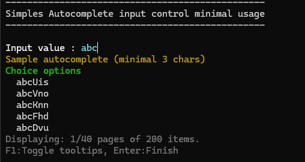

- Banner Ascii
    
    [**Top**](#table-of-contents)

    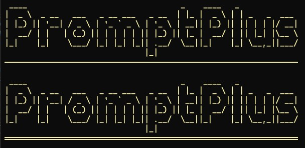

- Calendar with multiple layouts
    
    [**Top**](#table-of-contents)

    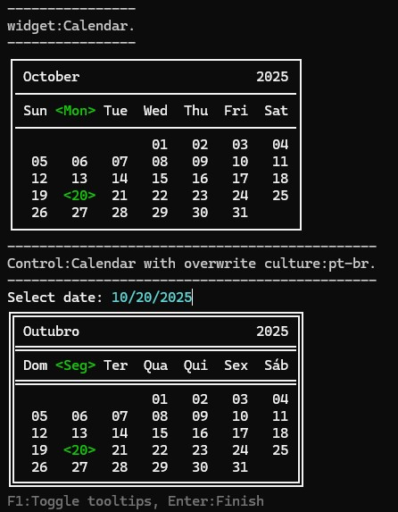

- ChartBar with switch layout, Legend and order
    
    [**Top**](#table-of-contents)

    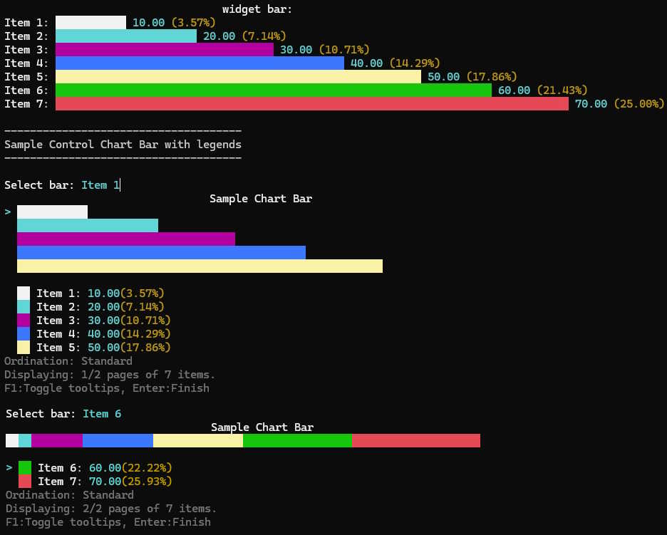

- File and Folder multi-select
    
    [**Top**](#table-of-contents)

    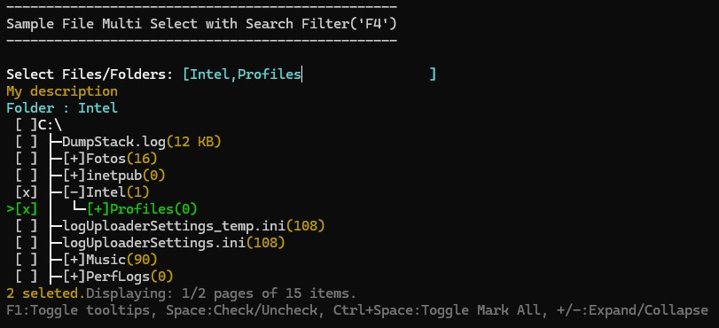

- File and Folder select
    
    [**Top**](#table-of-contents)

    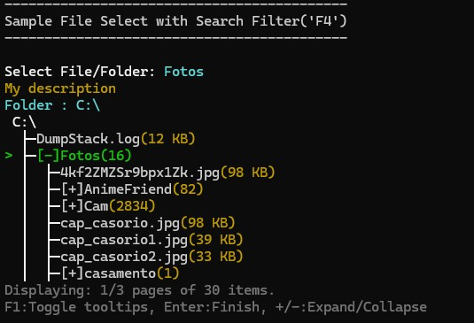

- Input text
    
    [**Top**](#table-of-contents)

    

- Input Secret 
    
    [**Top**](#table-of-contents)

    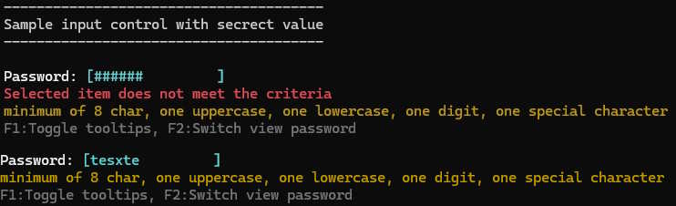

- KeyPress
    
    [**Top**](#table-of-contents)

    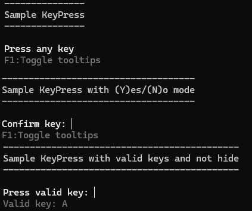

- MaskEdit Generic (string)
    
    [**Top**](#table-of-contents)

    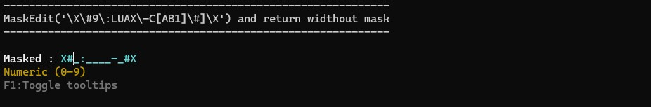

- MaskEdit Date (DateTime/DateOnly)
    
    [**Top**](#table-of-contents)

    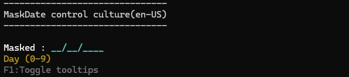

- MaskEdit Time (DateTime/TimeOnly)
    
    [**Top**](#table-of-contents)

    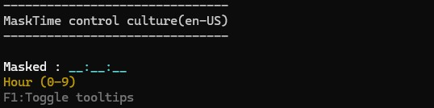

- MaskEdit DateTime 
    
    [**Top**](#table-of-contents)

    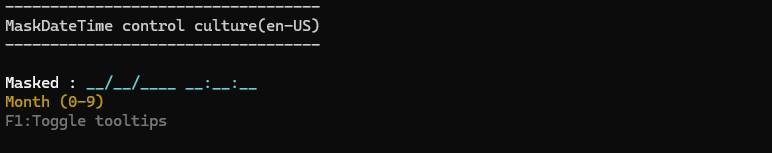

- MaskEdit Number (integer,long,double,decimal)
    
    [**Top**](#table-of-contents)

    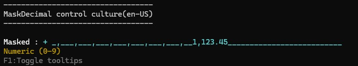

- MaskEdit Currency (double,decimal)
    
    [**Top**](#table-of-contents)

    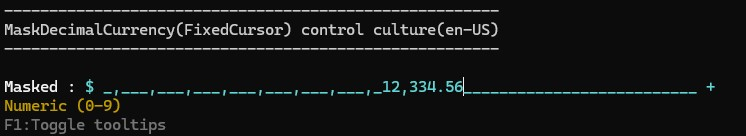

- Multi-Select for any type (with group!) 
    
    [**Top**](#table-of-contents)

    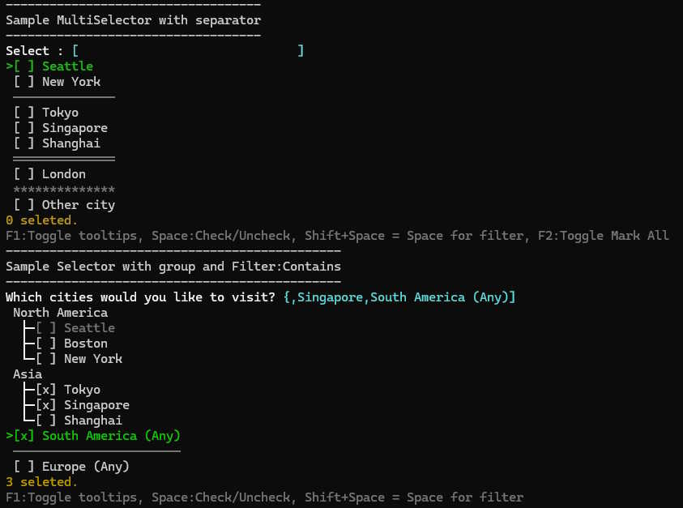

- Nodes hierarchical structures multi-select for any type
    
    [**Top**](#table-of-contents)

    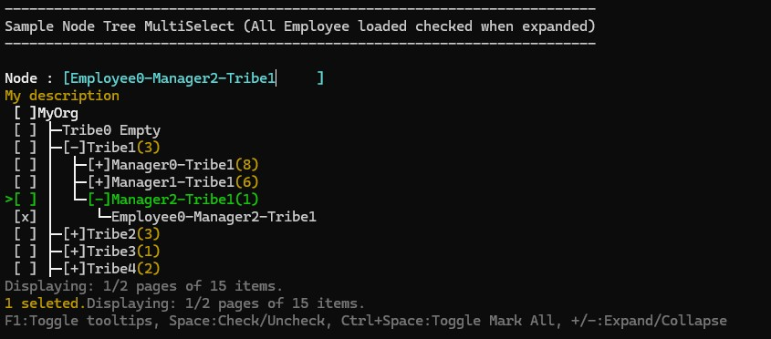

- Nodes hierarchical structures select for any type
    
    [**Top**](#table-of-contents)

    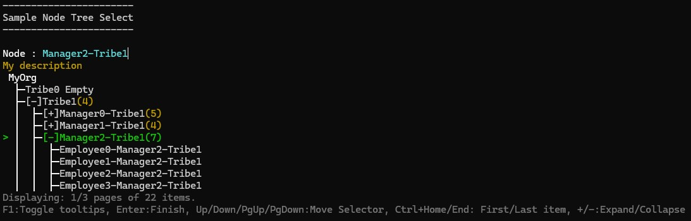

- Progress bar with 6 types , gradient colors and spinner
    
    [**Top**](#table-of-contents)

    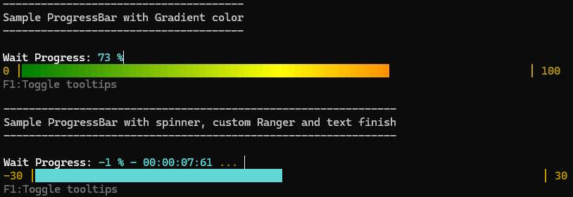

- ReadLine Emacs
    
    [**Top**](#table-of-contents)

    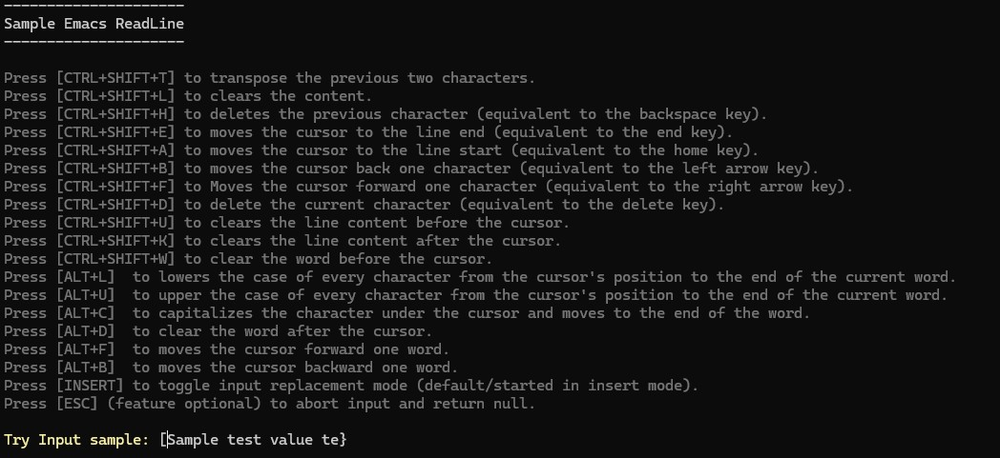

- Select for any type (with group!) 
    
    [**Top**](#table-of-contents)

    

- Slider numeric ranger with gradient colors
    
    [**Top**](#table-of-contents)

     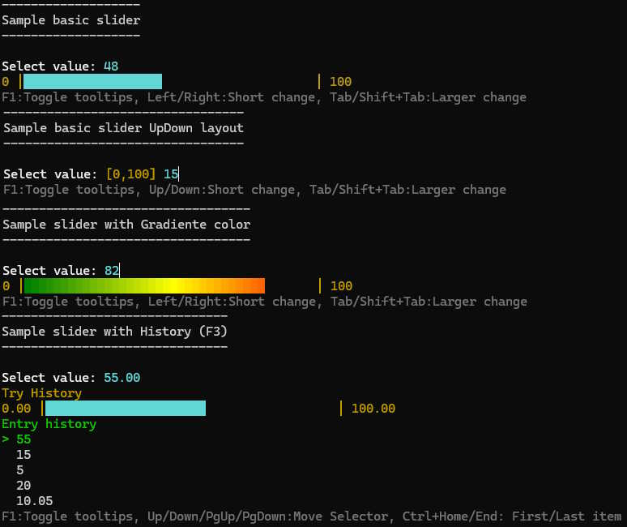

- Switch (style on/off)
    
    [**Top**](#table-of-contents)

     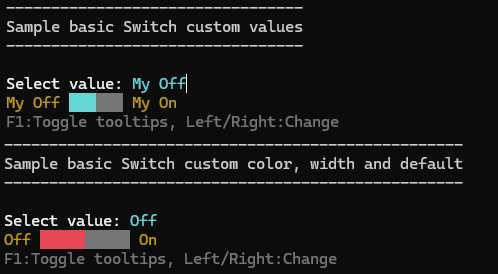

- Table structures multi-select for any type and multiple layouts
    
    [**Top**](#table-of-contents)

     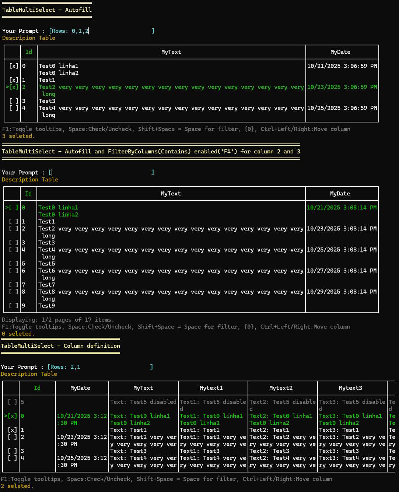

- Table structures select for any type and multiple layouts
    
    [**Top**](#table-of-contents)

     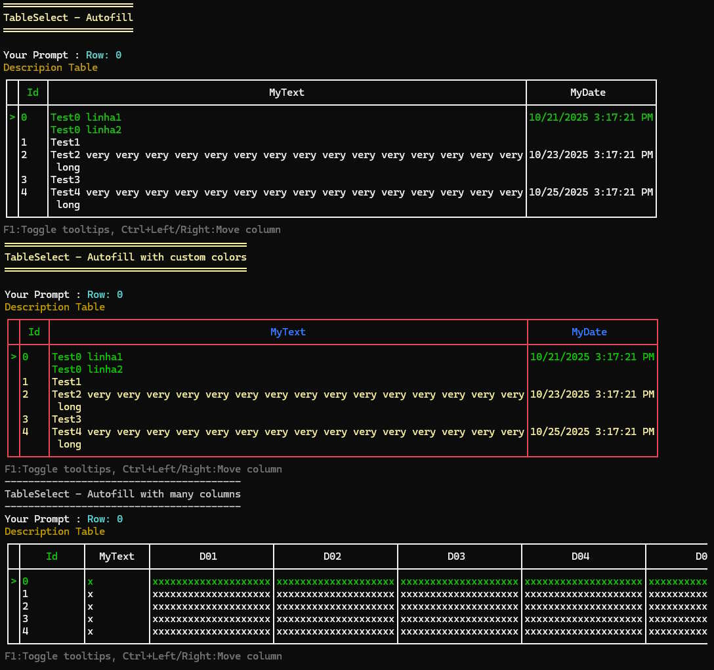

- Wait Process (Run background tasks Sequential/Parallel) with elapsedtime and spinner 
    
    [**Top**](#table-of-contents)

     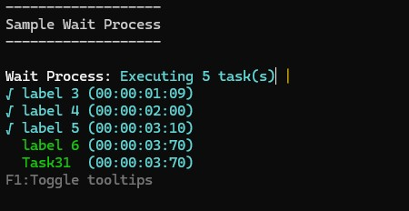

- Wait Time with countdown and spinner
    
    [**Top**](#table-of-contents)

     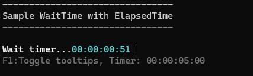

- Driver console **Supports 48/24-bit color** in the terminal with **automatic detection** of the current terminal capabilities, allowing you to fix the settings (Profile)
    
    [**Top**](#table-of-contents)

     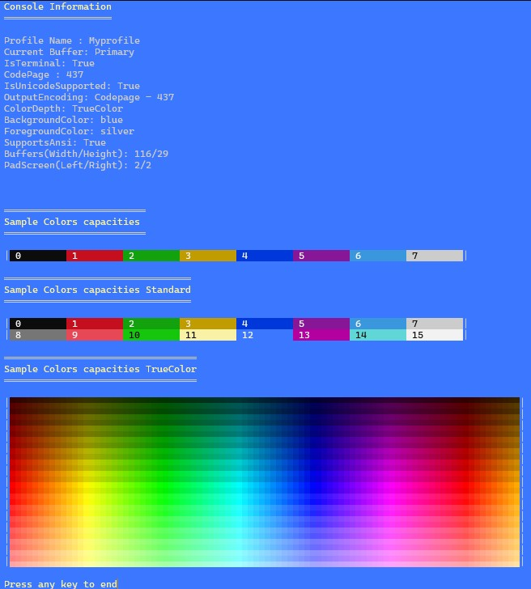

## Installing
[**Top**](#table-of-contents)

```
Install-Package PromptPlus [-pre]
```

```
dotnet add package PromptPlus [--prerelease]
```

**_Note:  [-pre]/[--prerelease] usage for pre-release versions_**

## Examples
[**Top**](#table-of-contents)

The folder [**Samples**](https://github.com/FRACerqueira/PromptPlus/tree/main/samples) contains more **25** projects samples!.

```
dotnet run --project [name of sample]
```

## Supported platforms
[**Top**](#table-of-contents)

- Windows
    - Command Prompt, PowerShell, Windows Terminal
- Linux (Ubuntu, etc)
    - Windows Terminal (WSL 2)
- macOS
    - Terminal.app

## Code of Conduct
[**Top**](#table-of-contents)

This project has adopted the code of conduct defined by the Contributor Covenant to clarify expected behavior in our community.
For more information see the [Code of Conduct](CODE_OF_CONDUCT.md).

## Contributing

See the [Contributing guide](CONTRIBUTING.md) for developer documentation.

## Credits
[**Top**](#table-of-contents)

Prompt Plus may **include pieces of code (copy)** from other software released under the MIT License:

- Color/Engine Console - [Spectre.Console](https://spectreconsole.net/),  Copyright (c) 2020 Patrik Svensson, Phil Scott, Nils Andresen. See [LICENSE](Licenses/LICENSE-SpectreConsole.md).

- Banner Ascii - [FIGlet](https://github.com/auriou/FIGlet), Copyright (c) 2014 Philippe AURIOU. See [LICENSE](Licenses/LICENSE-FIGlet.md).  

- East Asian caracters -  [EastAsianWidthDotNet](https://github.com/nuitsjp/EastAsianWidthDotNet), Copyright (c) 2020 Atsushi Nakamura. See [LICENSE](Licenses/LICENSE-EastAsianWidthDotNet.md).

## License
[**Top**](#table-of-contents)

Copyright 2025 @ Fernando Cerqueira

PromptPlus is licensed under the MIT license. See [LICENSE](https://github.com/FRACerqueira/PromptPlus/blob/master/LICENSE).

