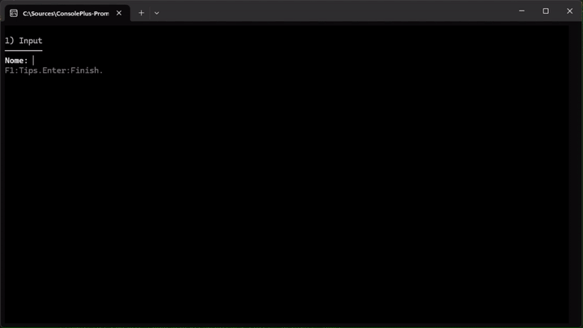

<div align="center">
  

  # PromptPlus

  **PromptPlus transforms your console apps with a modern .NET library that delivers polished, interactive experiences — from text input with history and searchable lists to masked fields, date/time pickers, file browsers, progress bars, charts, and more — all streamlined through one sleek fluent API.**

  [](https://www.nuget.org/packages/PromptPlus)
  [](https://opensource.org/licenses/MIT)
  [](https://dotnet.microsoft.com/)
  [](https://www.nuget.org/packages/PromptPlus)
  [](https://www.nuget.org/packages/PromptPlus/)

</div>

> 🤖 **New:** pick the right ConsolePlus/PromptPlus layer and control conversationally with the [**ConsolePlus + PromptPlus Plugin**](https://github.com/FRACerqueira/ConsolePlus-PromptPlus-IA-Plugin) — works with Claude Code or GitHub Copilot to choose the layer, check whether an interactive control can run in your context, pick the right one of PromptPlus's 21 controls, implement it, and audit existing usage. [Learn more ↓](#using-promptplus-with-claude-code-or-github-copilot)

---

## Highlights

- **20+ interactive controls** — from a simple key-press to multi-column tables and tree browsers
- **6 output-only widgets** — render sliders, calendars, banners, charts and more without blocking
- **Fluent API** — every control is configured with readable method chains
- **Two-layer config** — set defaults once with `PromptPlus.Config`, override per control with `.Options()`
- **Abort anywhere** — Esc aborts any control; result carries an `IsAborted` flag
- **History persistence** — last confirmed value saved and pre-loaded automatically
- **Terminal-safe** — auto-detects size, re-renders on resize, enforces 80×10 minimum gracefully
- **Cross-platform** — Windows, Linux, macOS; .NET 8, 9 and 10
- **Demo Mode** — script keyboard input to auto-record GIFs of your controls, no human needed ([`AutoDemoSamples`](samples/AutoDemoSamples/Program.cs))

<div align="center">
  
</div>

---

## What's new in the latest version

### 📢 Release Note – PromptPlus V.6.X Release Candidate

### 🚀 Release Candidate Phase
- The **6.X** version officially enters the **Release Candidate phase**.  
- Purpose: final validation before the stable release — no new features expected, only stabilization fixes.

### 🛠️ Source Code
- Available in the **main** branch.  

### 📦 NuGet Package
- Latest update: **6.0.0-rc[seq]**.  
- To install, you must **enable the pre-release option** in NuGet.

### 💬 Community Feedback
- This space is open for:  
  - Sharing **feedback**  
  - Reporting **issues**  
  - Suggesting **enhancements**

---

## Installation

PromptPlus 6.x is currently in **Beta** — you must enable pre-release packages to install it.

```shell
dotnet add package PromptPlus --prerelease
```

Or via the Package Manager Console:

```powershell
Install-Package PromptPlus -IncludePrerelease
```

---

## Quick Start

```csharp
using PromptPlusLibrary;

// Ask for a name
var nameResult = PromptPlus.Controls.Input("Your name").Run();
if (nameResult.IsAborted) return;

// Choose a color
var colorResult = PromptPlus.Controls
    .Select<string>("Favorite color")
    .AddItems(["Red", "Green", "Blue"])
    .Run();

// Deconstruct result
var (color, aborted) = colorResult;
if (!aborted)
    PromptPlus.Console.WriteLine($"Hello {nameResult.Content}, you chose {color}!");
```

> 💡 **Tip:** Every control returns `ResultPrompt<T>`. Use `.Content` for the value, `.IsAborted` to detect Esc, or deconstruct with `var (value, aborted) = result`.

---

## Two-Layer Configuration

### Layer 1 — Global defaults (applied to all controls)

```csharp
using PromptPlusLibrary;

PromptPlus.Config.PageSize = 8;
PromptPlus.Config.HideAfterFinish = true;
```

### Layer 2 — Per-control override (`.Options()` fluent method)

```csharp
PromptPlus.Controls
    .Input("Notes")
    .Options(o => o
        .HideAfterFinish(false)
        .ShowTooltip(false))
    .Run();
```

Per-control settings always win over global config. See [`docs/global-behaviors.md`](docs/global-behaviors.md) for the full property reference.

### Persist config to disk

```csharp
// Write PromptPlus.config to the current directory
PromptPlus.Config.ToFile(".");
```

On next run, PromptPlus automatically reads `PromptPlus.config` from the working directory.

---

## Global Behaviors

| Behavior | Observable effect |
|---|---|
| Terminal resize detection | Control re-renders its own area; surrounding output is untouched |
| Minimum terminal size (80×10) | Shows a resize prompt and waits — never crashes |
| Culture isolation | `DefaultCulture` applied only during `.Run()`; thread culture always restored |
| Single-line rendering | Newlines stripped; sliding window with `…` when value is too wide |
| History persistence | Last confirmed value saved to disk; pre-loaded on next run |
| HideAfterFinish | Control UI erased after confirmation; only the final answer line remains |
| HideOnAbort | Control UI erased when user presses Esc |
| Ctrl+C handling | Intercepted by default → triggers abort; set `RemoveHandlerCtrlC = true` to pass to OS |
| Tooltip visibility | `ShowTooltip = true` shows keyboard hints below the prompt |
| Abort key hint | `ShowMessageAbortKey = true` includes the abort-key name in the tooltip |
| Auto-initialization | PromptPlus initializes on first access: detects terminal, loads config, registers error log |

---

## Localization

PromptPlus ships **11 built-in locales** as embedded resources. The active locale is selected automatically from `CultureInfo.CurrentCulture`; override it at any time with:

```csharp
PromptPlus.Config.DefaultCulture = new CultureInfo("pt-BR");
```

| Culture code | Language |
|---|---|
| *(default)* | English |
| `pt-BR` | Portuguese (Brazil) |
| `de-DE` | German |
| `es-ES` | Spanish |
| `fr-FR` | French |
| `it-IT` | Italian |
| `ja-JP` | Japanese |
| `ko-KR` | Korean |
| `nl-BE` | Dutch (Belgium) |
| `ru-RU` | Russian |
| `zh-CN` | Chinese (Simplified) |

> If `DefaultCulture` is set to a culture that has no embedded resource, PromptPlus falls back to the default English strings.

### Adding a custom locale

If your target culture is not listed above, you can provide your own satellite resource:

1. Copy `PromptPlus/Resources/PromptPlusResources.resx` from the source tree (or extract it from the NuGet package).
2. Translate every message value to your language, keeping the existing key names and format placeholders unchanged.
3. Compile the `.resx` file into a binary `.resources` file — see [Compiling .resx files (Microsoft docs)](https://learn.microsoft.com/dotnet/core/extensions/work-with-resx-files-programmatically).
4. Place the compiled file, named `PromptPlus.<culture-code>.resources` (e.g. `PromptPlus.pl-PL.resources`), in the same directory as your application binaries.

PromptPlus will discover and load it automatically at runtime via the standard .NET resource fallback chain.

---

## Controls Reference

| Control | Factory method | Returns |
|---|---|---|
| [Text&nbsp;input](docs/controls/input/index.md) | `PromptPlus.Controls.Input(prompt)` | `ResultPrompt<string>` |
| [Secret&nbsp;/&nbsp;password](docs/controls/secret/index.md) | `PromptPlus.Controls.Secret(prompt)` | `ResultPrompt<string>` |
| [Key&nbsp;press](docs/controls/keypress/index.md) | `PromptPlus.Controls.KeyPress(prompt)` | `ResultPrompt<ConsoleKeyInfo?>` |
| [Confirm&nbsp;(yes/no)](docs/controls/confirm/index.md) | `PromptPlus.Controls.Confirm(prompt)` | `ResultPrompt<ConsoleKeyInfo?>` |
| [Single&nbsp;select](docs/controls/select/index.md) | `PromptPlus.Controls.Select<T>(prompt)` | `ResultPrompt<T>` |
| [Multi&nbsp;select](docs/controls/multiselect/index.md) | `PromptPlus.Controls.MultiSelect<T>(prompt)` | `ResultPrompt<IEnumerable<T>>` |
| [Table&nbsp;select](docs/controls/tableselect/index.md) | `PromptPlus.Controls.TableSelect<T>(prompt)` | `ResultPrompt<TableSelectResult<T>>` |
| [Table&nbsp;multi-select](docs/controls/tablemultiselect/index.md) | `PromptPlus.Controls.TableMultiSelect<T>(prompt)` | `ResultPrompt<T[]>` |
| [Tree&nbsp;select](docs/controls/treeselect/index.md) | `PromptPlus.Controls.TreeSelect<T>(prompt)` | `ResultPrompt<T?>` |
| [Tree&nbsp;multi-select](docs/controls/treemultiselect/index.md) | `PromptPlus.Controls.TreeMultiSelect<T>(prompt)` | `ResultPrompt<T[]>` |
| [File&nbsp;browser](docs/controls/file/index.md) | `PromptPlus.Controls.File(prompt)` | `ResultPrompt<FileInfo>` |
| [Multi-file](docs/controls/multifile/index.md) | `PromptPlus.Controls.MultiFile(prompt)` | `ResultPrompt<IEnumerable<FileInfo>>` |
| [Calendar](docs/controls/calendar/index.md) | `PromptPlus.Controls.Calendar(prompt)` | `ResultPrompt<DateTime>` |
| [Progress&nbsp;bar](docs/controls/progressbar/index.md) | `PromptPlus.Controls.ProgressBar(prompt)` | `ResultPrompt<double>` |
| [Task](docs/controls/task/index.md) | `PromptPlus.Controls.Task(prompt)` | `ResultPrompt<StateTask>` |
| [Multi-tasks](docs/controls/multitasks/index.md) | `PromptPlus.Controls.MultiTasks(prompt)` | `ResultPrompt<IEnumerable<MultiTaskResult>>` |
| [Chart&nbsp;bar](docs/controls/chartbar/index.md) | `PromptPlus.Controls.ChartBar(prompt)` | `ResultPrompt<double>` |
| [Mask&nbsp;—&nbsp;string](docs/controls/maskedit/index.md) | `PromptPlus.Controls.MaskEdit(prompt)` | `ResultPrompt<string>` |
| [Mask&nbsp;—&nbsp;integer](docs/controls/maskedit/index.md) | `PromptPlus.Controls.MaskInteger(prompt)` | `ResultPrompt<int>` |
| [Mask&nbsp;—&nbsp;long](docs/controls/maskedit/index.md) | `PromptPlus.Controls.MaskLong(prompt)` | `ResultPrompt<long>` |
| [Mask&nbsp;—&nbsp;decimal](docs/controls/maskedit/index.md) | `PromptPlus.Controls.MaskDecimal(prompt)` | `ResultPrompt<decimal>` |
| [Mask&nbsp;—&nbsp;decimal&nbsp;currency](docs/controls/maskedit/index.md) | `PromptPlus.Controls.MaskDecimalCurrency(prompt)` | `ResultPrompt<decimal>` |
| [Mask&nbsp;—&nbsp;double](docs/controls/maskedit/index.md) | `PromptPlus.Controls.MaskDouble(prompt)` | `ResultPrompt<double>` |
| [Mask&nbsp;—&nbsp;double&nbsp;currency](docs/controls/maskedit/index.md) | `PromptPlus.Controls.MaskDoubleCurrency(prompt)` | `ResultPrompt<double>` |
| [Mask&nbsp;—&nbsp;date&nbsp;&&nbsp;time](docs/controls/maskedit/index.md) | `PromptPlus.Controls.MaskDateTime(prompt)` | `ResultPrompt<DateTime>` |
| [Mask&nbsp;—&nbsp;date&nbsp;only](docs/controls/maskedit/index.md) | `PromptPlus.Controls.MaskDate(prompt)` | `ResultPrompt<DateTime>` |
| [Mask&nbsp;—&nbsp;DateOnly](docs/controls/maskedit/index.md) | `PromptPlus.Controls.MaskDateOnly(prompt)` | `ResultPrompt<DateOnly>` |
| [Mask&nbsp;—&nbsp;time&nbsp;only](docs/controls/maskedit/index.md) | `PromptPlus.Controls.MaskTime(prompt)` | `ResultPrompt<DateTime>` |
| [Mask&nbsp;—&nbsp;TimeOnly](docs/controls/maskedit/index.md) | `PromptPlus.Controls.MaskTimeOnly(prompt)` | `ResultPrompt<TimeOnly>` |

---

## Widgets Reference

Widgets are output-only — no user input, no `ResultPrompt`. `Banner` and `Dash` render immediately;
the fluent widgets (`Slider`, `Calendar`, `Switch`, `ChartBar`) render when you call `.Show()`.

| Widget | Factory method | Output |
|---|---|---|
| [Slider (display)](docs/widgets.md) | `PromptPlus.Widgets.Slider(value, min, max, fracionaldig)` | `ISliderWidget` |
| [Calendar (display)](docs/widgets.md) | `PromptPlus.Widgets.Calendar(dateref)` | `ICalendarWidget` |
| [Switch (display)](docs/widgets.md) | `PromptPlus.Widgets.Switch(value)` | `ISwitchWidget` |
| [Banner](docs/widgets.md) | `PromptPlus.Widgets.Banner(text)` | immediate render |
| [Dash separator](docs/widgets.md) | `PromptPlus.Widgets.Dash(text)` | immediate render |
| [Chart bar (display)](docs/widgets.md) | `PromptPlus.Widgets.ChartBar()` | `IChartBarWidget` |

---

## ConsolePlus Integration

**[ConsolePlus](https://github.com/FRACerqueira/ConsolePlus)** gives you a rock-solid rendering foundation: styled output, markup, colors, widgets,
cursor/screen control, and capability detection. **PromptPlus** is the complementary product that builds **on top of** that foundation to deliver **intelligent,
professional, interactive console controls** — the kind of rich prompts you'd otherwise have to build
by hand.

> **In one sentence:** ConsolePlus is *how you render*; PromptPlus is *how you interact*.

### Why two products?

**[ConsolePlus](https://github.com/FRACerqueira/ConsolePlus)** deliberately stays focused on **rendering primitives**. It ships the input building
blocks you need for simple scenarios — `ReadLine`, `ReadKey`, and even
[Emacs-style line editing](reading-input.md#the-emacs-style-line-editor) — but it intentionally stops
short of full interactive UI.

**PromptPlus** picks up exactly where those primitives end, adding **stateful, keyboard-driven controls**
with validation, paging, filtering, history, and theming — all rendered through the same ConsolePlus
engine, so colors, markup, and capability fallbacks behave identically.

---

### How they fit together

```text
┌──────────────────────────────────────────────┐
│                  Your app                    │
├────────────────────────┬─────────────────────┤
│      PromptPlus        │                     │
│  (interactive controls)│                     │
│  Input · Select · ...  │   ← optional layer  │
├────────────────────────┴─────────────────────┤
│                 ConsolePlus                  │
│  output · markup · colors · widgets · ANSI   │
│  cursor/screen · capability detection        │
└──────────────────────────────────────────────┘
```

PromptPlus references ConsolePlus and reuses its console driver directly. In fact,
`PromptPlus.Console` **is** the ConsolePlus driver — so anything you learned in the
[Writing Output](writing-output.md), [Markup](markup.md), and [Colors](colors.md) guides applies
unchanged inside PromptPlus.

### The `PromptPlus` entry point

Just like `ConsolePlus`, `PromptPlus` is a static facade. It exposes four members:

| Member | Type | Purpose |
|--------|------|---------|
| `PromptPlus.Console` | `IConsole` | The shared ConsolePlus console driver |
| `PromptPlus.Controls` | `IControls` | Factory for interactive controls |
| `PromptPlus.Widgets` | `IWidgets` | Banners, dashes, calendar and other visual widgets |
| `PromptPlus.Config` | `IPromptPlusConfig` | Global configuration (themes, behavior) |

```csharp
using ConsolePlusLibrary;
using PromptPlusLibrary;

// Rendering — identical to ConsolePlus
PromptPlus.Console.WriteLine("[Teal]Powered by ConsolePlus[/]");

// Widgets
PromptPlus.Widgets.Banner("PromptPlus", Color.Bisque);
```

---

`PromptPlus.Console` exposes the same `IConsole` driver as `ConsolePlus`. Use it to write styled text, manage cursor, and compose output alongside your controls:

```csharp
using ConsolePlusLibrary;
using PromptPlusLibrary;

// These two are the same object:
PromptPlus.Console.WriteLine("Hello, [bold]world[/]!");
ConsolePlus.WriteLine("Hello, [bold]world[/]!");
```

---

## Samples

The `samples/` folder contains runnable projects for every control and widget — one sample per
concept — plus [`AutoDemoSamples`](samples/AutoDemoSamples/Program.cs), which scripts a walkthrough of
several controls using [Demo Mode](docs/demo-mode.md) and is the actual source used to record the
demo GIF above.

---

## Documentation

| Page | Description |
|---|---|
| [Getting Started](docs/getting-started.md) | Install, first app, config walkthrough |
| [Architecture](docs/architecture.md) | Entry points, lifecycle, ResultPrompt |
| [Global Behaviors](docs/global-behaviors.md) | Full IPromptPlusConfig reference |
| [Keyboard Bindings](docs/keyboard-bindings.md) | Emacs shortcuts, physical key reference |
| [Visual Symbols](docs/visual-symbols.md) | Symbol catalog |
| [Global Styles](docs/global-styles.md) | Style override API |
| [Widgets](docs/widgets.md) | Output-only widgets guide |
| [Demo Mode](docs/demo-mode.md) | Scripted keyboard input for recording GIFs/videos of console apps |
| [Controls index](docs/index.md) | All pages in one place |
| [Migration Guide v5.x → v6.x](docs/migration-v5-to-v6.md) | **Upgrading from v5.x** |
| [API Reference](docs/api/PromptPlusLibrary.md) | Auto-generated API docs |

---

## Using PromptPlus with Claude Code or GitHub Copilot

Prefer describing what you need in plain language instead of driving the API by hand? The official
[**ConsolePlus + PromptPlus Plugin**](https://github.com/FRACerqueira/ConsolePlus-PromptPlus-IA-Plugin)
lets [Claude Code](https://claude.com/claude-code) or [GitHub Copilot](https://github.com/features/copilot)
choose and implement the right control for you:

- A skill (`select-promptplus-control`) that decides whether the need is ConsolePlus rendering or a
  `PromptPlus.Controls` interactive control, checks whether that control can even run in the target
  context (redirected input, CI, hosted services), picks the right one of PromptPlus's 21 controls,
  and implements it against the real, version-pinned fluent API — not a guess from memory.
- A `promptplus-auditor` agent that audits existing ConsolePlus/PromptPlus usage in a codebase (the
  redirected-input guard gap, unchecked `IsAborted`, `IWidgets` namespace mix-ups, global `Config`
  vs. `.Options()`) and produces a read-only report.
- A `promptplus-precommit-check` agent that catches the two cheapest bug-risk patterns on just the
  pending diff, before a commit/PR.

Requires PromptPlus 6.0 or later; applies to console-type .NET projects only — enforced automatically
by a hook on Claude Code, or checked by the skill itself on Copilot, which has no hook mechanism.

---

## Architecture Decision Records (ADR)

PromptPlus documents its significant architectural and design decisions as
**Architecture Decision Records (ADR)**, following the
[AdrPlus](https://github.com/FRACerqueira/AdrPlus) convention. Each record
captures the context, the decision, the alternatives considered, and the
consequences — so the reasoning behind the library's design stays traceable over
time.

👉 See the **[ADR index](docs/adr/indexadrs.md)** for the full list of decisions.

---

## Code of Conduct
This project has adopted the code of conduct defined by the Contributor Covenant to clarify expected behavior in our community.
For more information see the [Code of Conduct](CODE_OF_CONDUCT.md).

----
## Contributing

See the [Contributing guide](CONTRIBUTING.md) for developer documentation.

**Special thanks**

- [ividyon](https://github.com/ividyon) for their continued contributions to product improvement.

## License

PromptPlus is licensed under the **[MIT License](https://opensource.org/licenses/MIT)**.

---

<div align="center">
  <sub>Maintained by the ConsolePlus project • © 2026 Fernando Cerqueira</sub>
</div>
