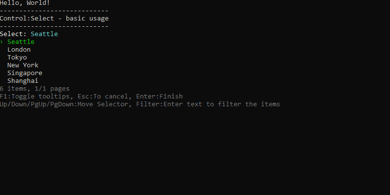
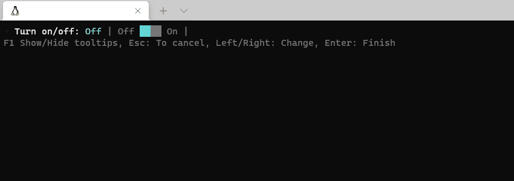

# Welcome to PromptPlus
[](https://github.com/FRACerqueira/PromptPlus/actions/workflows/build.yml)
[](https://github.com/FRACerqueira/PromptPlus/actions/workflows/publish.yml)
[](https://www.nuget.org/packages/PromptPlus/)
[](https://www.nuget.org/packages/PromptPlus/)
[](https://github.com/FRACerqueira/PromptPlus/blob/master/LICENSE)

**_Interactive command-line  toolkit for C# with powerful controls._** This project was inspired by the work [Sharprompt](https://github.com/shibayan/Sharprompt). A complete refatoring was done , introducing  **_new features and behavior, making the product more complete, more stable and more configurable_**. 

#### [visit the official page for complete documentation](https://fracerqueira.github.io/PromptPlus/)

## Examples
The project in the folder **PromptPlusExample** contains all the samples.

```
dotnet run --project PromptPlusExample
```

## Snapshot
[**Usage**](#usage) | [**Install**](#install) | [**Organization**](#organization) | [**Api Controls**](#apis) | [**Extensions**](#extensions) | [**Supported Platforms**](#supported-platforms)

### Input


### MaskEdit
[**Top**](#welcome-to-promptplus)


### KeyPress
[**Top**](#welcome-to-promptplus)


### Selectors
[**Top**](#welcome-to-promptplus)




### Confirm
[**Top**](#welcome-to-promptplus)




### WaitProcess
[**Top**](#welcome-to-promptplus)


### ProgressBar
[**Top**](#welcome-to-promptplus)


### Slider Number
[**Top**](#welcome-to-promptplus)


### List
[**Top**](#welcome-to-promptplus)


### Browser
[**Top**](#welcome-to-promptplus)


### PipeLine
[**Top**](#welcome-to-promptplus)


## Usage
[**Top**](#welcome-to-promptplus)

```csharp
//MaskEdit Generic
var mask = PromptPlus.MaskEdit(MaskedType.Generic, "Inventory Number")
    .Mask(@"\XYZ 9{3}-L{3}-C[ABC]N{1}[XYZ]-A{3}")
    .Run(_stopApp);

if (mask.IsAborted)
{
    return;
}
if (string.IsNullOrEmpty(mask.Result.Value))
{
    Console.WriteLine($"your input was empty!");
}
else
{
    Console.WriteLine($"your input was {mask.Result.ObjectValue}!");
}

//AnyKey
var key = PromptPlus.KeyPress()
        .Run(_stopApp);

if (key.IsAborted)
{
    return;
}
Console.WriteLine($"Hello, key pressed");


//input
var name = PromptPlus.Input("What's your name?")
    .Default("Peter Parker")
    .Addvalidator(PromptValidators.Required())
    .Addvalidator(PromptValidators.MinLength(3))
    .Run(_stopApp);

if (name.IsAborted)
{
    return;
}
Console.WriteLine($"Hello, {name.Result}!");
```

## Install
[**Top**](#welcome-to-promptplus)

PromptPlus was developed in c# with the **netstandard2.1** target framework, with compatibility for:

- NET Framework 4.8
- .NET Core 3.1
- .NET Core 5.0
- .NET Core 6.X

```
Install-Package PromptPlus [-pre]
```

```
dotnet add package PromptPlus [--prerelease]
```

**_Note:  [-pre]/[--prerelease] usage for pre-release versions_**

## Organization
[**Top**](#welcome-to-promptplus)

All controls have the same lines organization:
- Message and data entry (ever)
- Filter (depends on the control)
- Tooltips (configurable)
- Collection subset items (depends on the control, page size and size of console/terminal)
- Page information (depends on size colletion, page size and size of console/terminal)
- Error message (depends on the control and validators)

tooltips can be global (hotkey always active - default F1) and control specific. All controls have the properties to show hide tooltips.

### Paging behavior
[**Top**](#welcome-to-promptplus)

When a control has a collection it can be paged with a limit of items per page. When the item per page limit is not entered, the number of items per page is set to the maximum allowed by the console/terminal size. If the console/terminal is resized, an adjustment will be made to a number of items per page and a message will be issued on the console (only when it is a terminal)

### Culture
[**Top**](#welcome-to-promptplus)

PromptPlus applies the language/culture **only when running controls**. The language/culture of the application is **not affected**. If language/culture is not informed, the application's language/culture will be used with fallback to en-US.

All messages are affected when changed language/culture. PromptPlus has languages embeded:
- en-US (Default)
- pt-BR
 
```csharp
//sample
PromptPlus.DefaultCulture = new CultureInfo("en-US");
```

To use a non-embedded language/culture:

- Use the **PromptPlusResources.resx** file that already has the package in the resources folder
- Translate messages with same format to your language/culture
- Convert .resx files to binary .resources files ([**reference link here**](https://docs.microsoft.com/en-us/dotnet/core/extensions/work-with-resx-files-programmatically))
- Publish the compiled file (**PromptPlus.{Language}.resources**) in the same folder as the binaries.

### Colors
[**Top**](#welcome-to-promptplus)

PromptPlus has a configurable color(16 color) schema.

```csharp
PromptPlus.ColorSchema.Answer = ConsoleColor.DarkRed;
PromptPlus.ColorSchema.Select = ConsoleColor.DarkCyan;
```

### Symbols
[**Top**](#welcome-to-promptplus)

PromptPlus has a configurable symbos with Unicode support (Multi-byte characters and Emoji😀🎉) and Fallback.

 ```csharp
//sample
PromptPlus.Symbols.Done = new Symbol("√", "V ");
```
**_Note: new Symbol() return : Symbol = single space and Fallback = double space._**

### Hotkeys
[**Top**](#welcome-to-promptplus)

Hotkeys (global and control-specific) are configurable. Some hotkeys are internal and reserved.

**internal and reserved hotkeys:**

- Enter (all Modifiers)
- Delete (all Modifiers)
- LeftArrow (all Modifiers)
- RightArrow (all Modifiers)
- UpArrow (all Modifiers)
- DownArrow (all Modifiers)
- PageUp (all Modifiers)
- PageDown (all Modifiers)
- Backspace (all Modifiers)

**_Note: If you use one of these keys, an ArgumentException will be generated._**

 ```csharp
//sample
PromptPlus.TooltipKeyPress = new HotKey(key: "F1", alt: false, ctrl: false, shift: false);
```

**_Note: the key parameter is case-insentive;_**

## Load and Save Settings
[**Top**](#welcome-to-promptplus)

PromptPlus allows saving and loading a previous configuration of culture, behavior, hotkeys, colors and symbols.A file with the default configuration is available in the package in the Resources folder named **PromptPlus.config.json** . To load automatically the file must be placed in your project and published in the **same folder** as the binaries.

```csharp
//sample save
PromptPlus.SaveConfigToFile(folderfile: "YourFolder");
//sample load
PromptPlus.LoadConfigFromFile(folderfile: "YourFolder");
```

**_Note: if the folderfile parameter is omitted, it will be saved/loaded from the default application folder_**

## Apis
[**Top**](#welcome-to-promptplus)

| controls | Details |
| --- | --- |
| [Any key](https://fracerqueira.github.io/PromptPlus/anykey) |  Simple any key press |
| [Key Press](https://fracerqueira.github.io/PromptPlus/keypress) | Simple specific key |
| [Confirm](https://fracerqueira.github.io/PromptPlus/confirm) | Simple confirm with  with tool tips and language detection |
| [Input](https://fracerqueira.github.io/PromptPlus/input) | Input text with input validator with tooltips |
| [Password](https://fracerqueira.github.io/PromptPlus/password) | Input password with input validator and show/hide(optional) input value |
| [MaskEdit Generic](https://fracerqueira.github.io/PromptPlus/maskeditgeneric) | Input with masked input , tooltips and input validator |
| [MaskEdit Date](https://fracerqueira.github.io/PromptPlus/maskeditdate) | Date input with language parameter, tooltips and input validator |
| [MaskEdit Time](https://fracerqueira.github.io/PromptPlus/maskeditdate) | Time input with language parameter, tooltips and input validator |
| [MaskEdit Date and Time](https://fracerqueira.github.io/PromptPlus/maskeditdate) | Date and time input with language parameter, tooltips and input validator |
| [MaskEdit Number](https://fracerqueira.github.io/PromptPlus/maskeditnumber) | Numeric input with language parameter, tooltips and input validator |
| [MaskEdit Currency](https://fracerqueira.github.io/PromptPlus/maskeditnumber) | Currency input with language parameter, tooltips and input validator |
| [Select](https://fracerqueira.github.io/PromptPlus/select)| Generic select input IEnumerable/Enum with auto-paginator and tooltips and more |
| [MultiSelect](https://fracerqueira.github.io/PromptPlus/multiselect) | Generic multi select input IEnumerable/Enum with auto-paginator , tooltips and more |
| [List](https://fracerqueira.github.io/PromptPlus/list) | Create Generic IEnumerable with auto-paginator, tooptip , input validator, message error by type/format and more |
| [ListMasked](https://fracerqueira.github.io/PromptPlus/listmasked) | Create generic IEnumerable with maskedit, auto-paginator, tooptip , input validator |
| [Browser](https://fracerqueira.github.io/PromptPlus/browser) | Browser files/folder with auto-paginator and tooltips |
| [Slider Number](https://fracerqueira.github.io/PromptPlus/slidernumber) | Numeric ranger with short/large step and tooltips |
| [Number Up/Down](https://fracerqueira.github.io/PromptPlus/numberupdown) | Numeric ranger with step and tooltips |
| [Slider Switche](https://fracerqueira.github.io/PromptPlus/sliderswitche) | Generic choice with customization and tooltips |
| [Progress Bar](https://fracerqueira.github.io/PromptPlus/progressbar) | Progress Bar with interation customization |
| [WaitProcess](https://fracerqueira.github.io/PromptPlus/waitprocess) | Wait process with animation |
| [PipeLine](https://fracerqueira.github.io/PromptPlus/pipeline) | Pipeline sequence to all prompts with condition by pipe and status summary |

## Extensions
PromptPlus have a extension to **import validator**. No duplicate code! 

```csharp
private class MylCass
{
    [Required(ErrorMessage = "{0} is required!")]
    [MinLength(3, ErrorMessage = "Min. Length = 3.")]
    [MaxLength(5, ErrorMessage = "Max. Length = 5.")]
    [Display(Prompt ="My Input")]
    public string MyInput { get; set; }
}
```
```csharp
var inst = new MylCass();
var name = PromptPlus.Input("Input Value for MyInput")
    .Addvalidators(inst.ImportValidators(x => x.MyInput))
    .Run(_stopApp);

if (name.IsAborted)
{
   return;
}
Console.WriteLine($"Your input: {name.Value}!");
```

## Supported platforms
[**Top**](#welcome-to-promptplus)

- Windows
    - Command Prompt, PowerShell, Windows Terminal
- Linux (Ubuntu, etc)
    - Windows Terminal (WSL 2)
- macOS
    - Terminal.app

## License

This project is licensed under the [MIT License](https://github.com/FRACerqueira/PromptPlus/blob/master/LICENSE)
