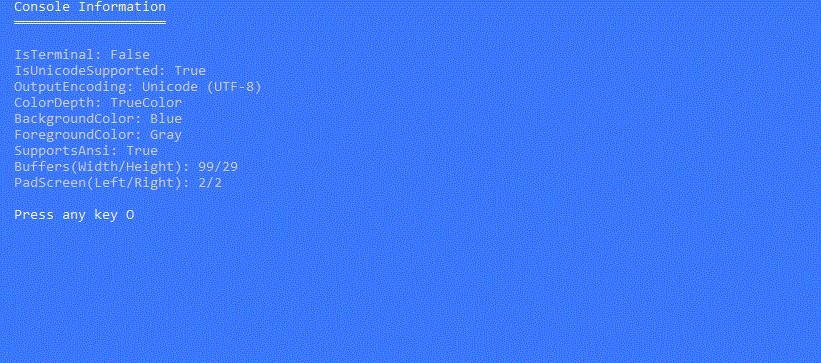

# Welcome to PromptPlus
[](https://github.com/FRACerqueira/PromptPlus/actions/workflows/build.yml)
[](https://github.com/FRACerqueira/PromptPlus/actions/workflows/publish.yml)
[](https://github.com/FRACerqueira/PromptPlus/blob/master/LICENSE)
[](https://www.nuget.org/packages/PromptPlus/)
[](https://www.nuget.org/packages/PromptPlus/)


**Interactive command-line toolkit for .Net core with powerful controls and commands to create professional console applications.**

**PromptPlus** was developed in c# with the **netstandard2.1**, **.Net 6** and **.Net 7** target frameworks.
**[Visit the official page for more documentation of PromptPlus](https://fracerqueira.github.io/PromptPlus)**

## Table of Contents

- [Features](#features)
- [Migrate Version](#migrate-version)
- [Console Engine](#console-engine)
- [Installing](#installing)
- [Examples](#examples)
- [Controls Snapshot](#controls-snapshot)
- [Usage](#usage)
- [Culture](#culture)
- [Colors](#colors)
- [Hotkeys](#hotkeys)
- [Keypress Extensions Emacs](#keypress-extensions-emacs)
- [Validators](#validators)
- [Supported Platforms](#supported-platforms)
- [Inspiration Notes](#inspiration-notes)
- [Code of Conduct](#code-of-conduct)
- [License](#license)

## Features

**All features have IntelliSense. The PromptPlus have more 20 controls with many features like: filters, validators, history, sugestions, spinner(19 embeding type and plus custom yours!), colors and styles for control-elements** :
- Banner Ascii
- Input text / Secret / AutoComplete with spinner
- MaskEdit Generic / Only Date / Only Time / DateTime / Number /  Currency
- Select and Multi-Select(with group select!) 
- AddTo(Add/Remove) items for text and masked text
- Wait Keypress with animate spinner
- Slider numeric ranger with gradient colors
- Up-Down numeric ranger 
- Switch (style on/off)
- Wait Process (Run background tasks Sequential/Parallel) with elapsedtime and spinner 
- Wait Time with countdown and spinner
- Progress bar with 8 types , gradient colors and spinner
- Browser File and Folder with multi-select, colors and spinner
- Treeview hierarchical structures with multi-select and colors

**All controls** have the same organization (see in action: [**Controls Snapshot**](#controls-snapshot)):
- input/filter (except Masked input) using **[GNU Readline](https://en.wikipedia.org/wiki/GNU_Readline) Emacs keyboard shortcuts**.  
- Prompt, description and data entry (ever)
- Extra actions per stage : OnStartControl/OnInputRender/OnTryAcceptInput/OnFinishControl (ever)
- Tooltips (ever and configurable) 
- Filter by Contains / StartsWith (configurable) (depends on the control)
- Collection subset items and interations (depends on the control)
- Page information and page-size(depends on the control)
- Spinner animmation (depends on the control)
- Error message (depends on the control and validators)

PromptPlus driver console  **Supports 4/8/24-bit colors** in the terminal with **auto-detection** of the current terminal's capabilities.

## Migrate Version
Until version 3 the console engine was based on a model from another project that has several serious problems that cause exceptions during execution in addition to increasing the complexity of the code for correct rendering...
**PromptPlus v4** has been **completely rebuilt** for a better experience, with significant improvements with new controls and more developer power. The console driver now supports better rendering, with the ability to detect terminal capabilities and allow for 24-bit color, text overflow strategies based on terminal size, and left and right margins for a nicer layout.
**The Controls have been revised to be more responsive, allow color styles in many of their elements**, and adapt to the terminal size even with resizing.

For migrate V3 to V4 [**see this link**](https://fracerqueira.github.io/PromptPlus/migrateversion.html).

## Console Engine
[**Top**](#welcome-to-promptplus)

The console driver have the ability to detect terminal capabilities and allow for **24-bit color and text overflow strategies**  based on terminal size, and left and right margins for a nicer layout.
The new engine detects support ansi commands and adjust output for this functionality respecting OS differences , terminal mode and Windows console mode. The Colors are automatically adjusted to the capacity of the terminal. This automatic adjustment may slightly modify the final color when converting to a lower bit resolution.

### Sample Output detect (ConsoleFeaturesSamples)


### Sample Output Overflow Capacity (ConsoleFeaturesSamples)


### Sample color capacity (ConsoleFeaturesSamples)

**_Note: This layout and code was inspired by the excellent project:spectreconsole, having the same color palette_**


## Installing
[**Top**](#welcome-to-promptplus)

```
Install-Package PromptPlus [-pre]
```

```
dotnet add package PromptPlus [--prerelease]
```

**_Note:  [-pre]/[--prerelease] usage for pre-release versions_**

## Examples
[**Top**](#welcome-to-promptplus)

The folder [**Samples**](https://github.com/FRACerqueira/PromptPlus/tree/Samples) contains more **30** samples!.

```
dotnet run --project [name of sample]
```

## Controls Snapshot

For each snapshot, the title is **name of projet** sample in folder **samples**

### Input
[**Top**](#welcome-to-promptplus)

[InputBasicSamples](https://github.com/FRACerqueira/PromptPlus/tree/Samples/InputBasicSamples)


[InputSecretSamples](https://github.com/FRACerqueira/PromptPlus/tree/Samples/InputSecretSamples)


[InputWithHistorySamples](https://github.com/FRACerqueira/PromptPlus/tree/Samples/InputWithHistorySamples)


[InputWithSugestionSamples](https://github.com/FRACerqueira/PromptPlus/tree/Samples/InputWithSugestionSamples)


[InputWithValidatorSamples](https://github.com/FRACerqueira/PromptPlus/tree/Samples/InputWithValidatorSamples)


**Other samples input**

[InputOverwriteDefaultFromSamples](https://github.com/FRACerqueira/PromptPlus/tree/Samples/InputOverwriteDefaultFromSamples)

### AutoComplete
[**Top**](#welcome-to-promptplus)

[AutoCompleteSamples](https://github.com/FRACerqueira/PromptPlus/tree/Samples/AutoCompleteSamples)


### MaskEdit
[**Top**](#welcome-to-promptplus)

[MaskEditGenericSamples](https://github.com/FRACerqueira/PromptPlus/tree/Samples/MaskEditGenericSamples)


[MaskEditDateTypeSamples](https://github.com/FRACerqueira/PromptPlus/tree/Samples/MaskEditDateTypeSamples)


[MaskEditTimeTypeSamples](https://github.com/FRACerqueira/PromptPlus/tree/Samples/MaskEditTimeTypeSamples)


[MaskEditDateTimeTypeSamples](https://github.com/FRACerqueira/PromptPlus/tree/Samples/MaskEditDateTimeTypeSamples)


[MaskEditNumberTypeSamples](https://github.com/FRACerqueira/PromptPlus/tree/Samples/MaskEditNumberTypeSamples)


[MaskEditCurrencyTypeSamples](https://github.com/FRACerqueira/PromptPlus/tree/Samples/MaskEditCurrencyTypeSamples)


### KeyPress
[**Top**](#welcome-to-promptplus)

[KeyPressSamples](https://github.com/FRACerqueira/PromptPlus/tree/Samples/KeyPressSamples)


[ConfirmSamples](https://github.com/FRACerqueira/PromptPlus/tree/Samples/ConfirmSamples)


### Select
[**Top**](#welcome-to-promptplus)

[SelectBasicSamples](https://github.com/FRACerqueira/PromptPlus/tree/Samples/SelectBasicSamples)


**Other samples Select**

[SelectUserScopeSamples](https://github.com/FRACerqueira/PromptPlus/tree/Samples/SelectUserScopeSamples) ,
[SelectUserTypeSamples](https://github.com/FRACerqueira/PromptPlus/tree/Samples/SelectUserTypeSamples)

### Multi Select
[**Top**](#welcome-to-promptplus)

[MultiSelectBasicSamples](https://github.com/FRACerqueira/PromptPlus/tree/Samples/MultiSelectBasicSamples)


**Other samples Multi-Select**
[MultiSelectUserScopeSamples](https://github.com/FRACerqueira/PromptPlus/tree/Samples/MultiSelectUserScopeSamples) ,
[MultiSelectUserTypeSamples](https://github.com/FRACerqueira/PromptPlus/tree/Samples/MultiSelectUserTypeSamples)

### Wait Process
[**Top**](#welcome-to-promptplus)

[WaitTasksSamples](https://github.com/FRACerqueira/PromptPlus/tree/Samples/WaitTasksSamples)


### Wait Time
[**Top**](#welcome-to-promptplus)

[WaitTimerSamples](https://github.com/FRACerqueira/PromptPlus/tree/Samples/WaitTimerSamples)


### Progress Bar
[**Top**](#welcome-to-promptplus)

[ProgressBarSamples](https://github.com/FRACerqueira/PromptPlus/tree/Samples/ProgressBarSamples)


### Slider Swith
[**Top**](#welcome-to-promptplus)

[SliderSwithSamples](https://github.com/FRACerqueira/PromptPlus/tree/Samples/SliderSwithSamples)


### Slider Number
[**Top**](#welcome-to-promptplus)

[SliderNumberUpDownModeSamples](https://github.com/FRACerqueira/PromptPlus/tree/Samples/SliderNumberUpDownModeSamples)


[SliderNumberLeftRightModeSamples](https://github.com/FRACerqueira/PromptPlus/tree/Samples/SliderNumberLeftRightModeSamples)


### Add to List
[**Top**](#welcome-to-promptplus)

[AddToListSamples](https://github.com/FRACerqueira/PromptPlus/tree/Samples/AddToListSamples)


[AddtoMaskEditListSamples](https://github.com/FRACerqueira/PromptPlus/tree/Samples/AddtoMaskEditListSamples)


### Browser Select
[**Top**](#welcome-to-promptplus)

[BrowserSamples](https://github.com/FRACerqueira/PromptPlus/tree/Samples/BrowserSamples)


### Browser Multi Select
[**Top**](#welcome-to-promptplus)

[BrowserMultSelectSamples](https://github.com/FRACerqueira/PromptPlus/tree/Samples/BrowserMultSelectSamples)


### TreeView Select
[**Top**](#welcome-to-promptplus)

[TreeViewSamples](https://github.com/FRACerqueira/PromptPlus/tree/Samples/TreeViewSamples)


### TreeView Multi Select
[**Top**](#welcome-to-promptplus)

[TreeViewMultiSelectSamples](https://github.com/FRACerqueira/PromptPlus/tree/Samples/TreeViewMultiSelectSamples)


### Banner
[**Top**](#welcome-to-promptplus)

[BannerSamples](https://github.com/FRACerqueira/PromptPlus/tree/Samples/BannerSamples)


## Usage
[**Top**](#welcome-to-promptplus)

All controls use **fluent interface**. A is an object-oriented API whose design relies extensively on method chaining. Its goal is to increase code legibility. The term was coined in 2005 by Eric Evans and Martin Fowler.

```csharp
//MaskEdit Generic
var mask = PromptPlus.MaskEdit("input", "MaskEdit Generic input")
    .Mask(@"\XYZ 9{3}-L{3}-C[ABC]N{1}[XYZ]-A{3}")
    .DescriptionWithInputType(FormatWeek.Short)
    .Run();

if (!mask.IsAborted)
{
    PromptPlus.WriteLine($"You input with mask is {mask.Value.Masked}");
    PromptPlus.WriteLine($"You input without mask is {mask.Value.Input}");
}

//AnyKey
var kp1 = PromptPlus
    .KeyPress()
    .Run();

if (!kp1.IsAborted)
{
    PromptPlus.WriteLine($"You Pressed {kp1.Value.Key}");
}

//input
var in1 = PromptPlus
    .Input("Input sample1")
    .Run();

if (!in1.IsAborted)
{
    PromptPlus.WriteLine($"You input is {in1.Value}");
}
```

## Culture
[**Top**](#welcome-to-promptplus)

PromptPlus applies the language/culture **only when running controls**. The language/culture of the application is **not affected**. If language/culture is not informed, the application's language/culture will be used with fallback to en-US.

All messages are affected when changed language/culture. PromptPlus has languages embeded:
- en-US (Default)
- pt-BR

To use a non-embedded language/culture:

- Copy the **PromptPlusResources.resx** file in folder PromptPlus/Resources
- Translate messages with same format to your language/culture
- Convert .resx files to binary .resources files ([**reference link here**](https://docs.microsoft.com/en-us/dotnet/core/extensions/work-with-resx-files-programmatically))
- Publish the compiled file (**PromptPlus.[Language].resources**) in the same folder as the binaries.

## Colors
[**Top**](#welcome-to-promptplus)

PromptPlus is in accordance with informal standard [**NO COLOR**](https://no-color.org/). when there is the environment variable "no_color" the colors are disabled.

PromptPlus also has commands for coloring parts of the text using **direct console, styles and Over elememnts of controls**.

Promptplus uses the **same default colors and engine(softly modified)** as the third party project: spectreconsole.
For more details [visit the **official page**](https://fracerqueira.github.io/PromptPlus/#colors) or see the samples in folder **Samples**


## Hotkeys
[**Top**](#welcome-to-promptplus)

Hotkeys (global and control-specific) are configurable. Some hotkeys are internal and reserved.
For more details [visit the **official page**](https://fracerqueira.github.io/PromptPlus/#hotkeys)

## Keypress Extensions Emacs
[**Top**](#welcome-to-promptplus)

PromptPlus have a lot extensions to check Key-press with GNU Readline Emacs keyboard shortcuts.
For more details [visit the **official page**](https://fracerqueira.github.io/PromptPlus/#keypress-extensions-emacs)

## Validators

PromptPlus have a lot extensions to **commons validator** and **validator import**(No duplicate code!) 
For more details [visit the **official page**](https://fracerqueira.github.io/PromptPlus/#validators) or see the samples in folder **Samples**

```csharp
private class MylCass
{
    [Required(ErrorMessage = "{0} is required!")]
    [MinLength(3, ErrorMessage = "Min. Length = 3.")]
    [MaxLength(5, ErrorMessage = "Max. Length = 5.")]
    [Display(Prompt ="My Input")]
    public string MyInput { get; set; }
}
```
```csharp
var inst = new MylCass();

PromptPlus
    .Input("Input sample2", "import validator from decorate")
    .Default(inst.Text)
    .AddValidators(PromptValidators.ImportValidators(inst,x => x!.Text!))
    .Run();

if (name.IsAborted)
{
   return;
}
PromptPlus.WriteLine($"Your input: {name.Value}!");
```

## Supported platforms
[**Top**](#welcome-to-promptplus)

- Windows
    - Command Prompt, PowerShell, Windows Terminal
- Linux (Ubuntu, etc)
    - Windows Terminal (WSL 2)
- macOS
    - Terminal.app

## Inspiration notes
[**Top**](#welcome-to-promptplus)

- FIGlet was inspired by the work of [FIGlet.Net](https://github.com/WenceyWang/FIGlet.Net).
- The colors and some of its dependencies were inspired by the work of [spectreconsole](https://spectreconsole.net/).

## Code of Conduct
[**Top**](#welcome-to-promptplus)

This project has adopted the code of conduct defined by the Contributor Covenant to clarify expected behavior in our community.
For more information see the [.NET Foundation Code of Conduct](https://dotnetfoundation.org/code-of-conduct).

## License
[**Top**](#welcome-to-promptplus)

Copyright © Fernando Cerqueira

PromptPlus project is licensed under the [MIT License](https://github.com/FRACerqueira/PromptPlus/blob/master/LICENSE)
