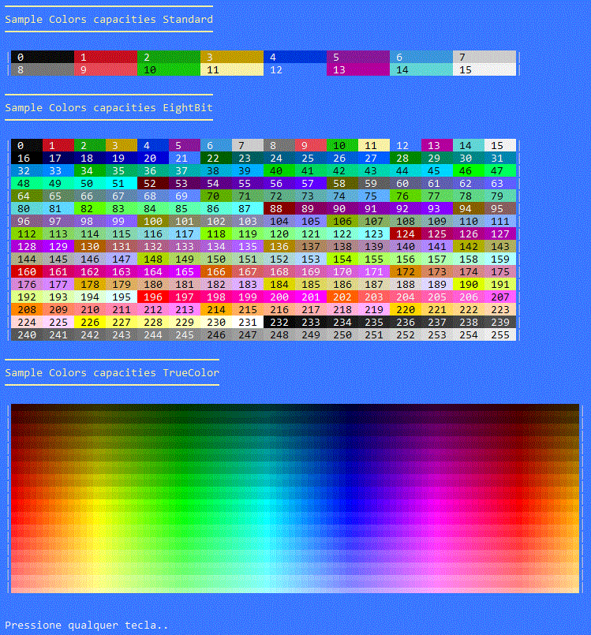

# Welcome to PromptPlus
[](https://github.com/FRACerqueira/PromptPlus/actions/workflows/build.yml)
[](https://github.com/FRACerqueira/PromptPlus/actions/workflows/publish.yml)
[](https://github.com/FRACerqueira/PromptPlus/blob/master/LICENSE)
[](https://www.nuget.org/packages/PromptPlus/)
[](https://www.nuget.org/packages/PromptPlus/)


**Interactive command-line toolkit for .NET Core with powerful controls and commands to create professional console applications.**

**PromptPlus** was developed in C# with the **netstandard2.1**, **.NET 6** and **.NET 7** target frameworks.
**[Visit the official page for more documentation of PromptPlus](https://fracerqueira.github.io/PromptPlus)**

## Table of Contents

- [What's new - previous versions](whatsnewprev.md)
- [Features](#features)
- [Migrate Version V3.3 to V4.0](#migrate-version)
- [Console Engine](#console-engine)
- [Installing](#installing)
- [Examples](#examples)
- [Controls Snapshot](#controls-snapshot)
- [Usage](#usage)
- [Culture](#culture)
- [Colors](#colors)
- [Hotkeys](#hotkeys)
- [Keypress Extensions Emacs](#keypress-extensions-emacs)
- [Validators](#validators)
- [Supported Platforms](#supported-platforms)
- [Code of Conduct](#code-of-conduct)
- [Contributing](#contributing)
- [Credits](#credits)
- [License](#license)
- [API Reference](https://fracerqueira.github.io/PromptPlus/apis/apis.html)

## What's new in the latest version
### V4.1.1
[**Top**](#table-of-contents)

- Split feature Control Table:
    - PromptPlus.TableSelect\<T> to Select item in table : Select row, column and data in a grid/table 
        - Samples in project [Table Select Samples](https://github.com/FRACerqueira/PromptPlus/tree/main/Samples/TableSelectSamples)
    - PromptPlus.Table\<T> to write table in console : Show data in a grid/table 
        - Samples in project [Table Samples](https://github.com/FRACerqueira/PromptPlus/tree/main/Samples/TableBasicSamples)
- New Control : TableMultSelect\<T> :  Select multi-data in a grid/table 
    - Samples in project [Table MultiSelect Samples](https://github.com/FRACerqueira/PromptPlus/tree/main/Samples/TableMultiSelectSamples)
    - Main features :
        - More than 80 layout combinations
        - Navigation by row and columns
        - Scroll the table when it is larger than the screen
        - Split text when it is larger than the column size
        - Automatic header and column completion
        - Color customization of each element
        - Search for data filtered by columns
        - Formatting by column or by data type definition
- New feature: 
    - MinimalRender the prompt and control description are not rendered, showing only the minimum necessary without using resources.
        - Global property : MinimalRender
        - Instance control(By config command): MinimalRender(bool value = true)
- New feature: 
    - Pagination Template to customize pagination information
        - Global property : PaginationTemplate
        - Instance control(By config command) : PaginationTemplate(Func<int, int, int, string>? value)
- New feature: 
    - PromptPlus.Join() 
    - Fluent-Interface to write text (less code typed) 
- Changed feature:
    - Moved tooltips and validation message to the end of render to all control
- Improvement : 
    - Optimized the Calendar control to have symbols when selecting elements
- Improvement :
    - Optimize Render of ProgressBar (less lines)
- Improvement : 
    - Optimize Render of SliderNumber (less lines)
- Improvement : 
    - Optimize resource usage in rendering (less cultural dependency)
- Improvement : 
    - Reinforce the validation of invalid or optional parameters in all controls
- Renamed command: 
    - 'DescriptionWithInputType' to 'ShowTipInputType'.
    - Now extra-line to tip InputType
- Renamed command: 
    - 'AppendGroupOnDescription' to 'ShowTipGroup'.
    - Now extra-line to tip group
- Fixed bug : 
    - The Slide Switch Control does not show on/off values ​​when they are not customized
- Fixed bug : 
    - Alternate screen doesn't update background style when changing color
- Fixed bug : 
    - Exception when try delete[F3] in empty colletion in AddTolist/AddtoMaskEditList control
- Fixed bug : 
    - Edit[F2] Immutable item in AddTolist/AddtoMaskEditList control
- Fixed bug : 
    - CTRL-V (paste data) does not show input in some controls

## Features
[**Top**](#table-of-contents)

**All features have IntelliSense. PromptPlus has more than 25 controls with many features like: filters, validators, history, suggestions, spinner(19 embedding type and plus custom yours!), colors and styles for control-elements** :
- Banner Ascii
- Input text / Secret / AutoComplete with spinner
- MaskEdit Generic / Only Date / Only Time / DateTime / Number /  Currency
- Calendar with multiple layouts
- Select and Multi-Select(with group select!) 
- AddTo(Add/Remove) items for text and masked text
- Wait Keypress with animate spinner
- Slider numeric ranger with gradient colors
- Up-Down numeric ranger 
- Switch (style on/off)
- Wait Process (Run background tasks Sequential/Parallel) with elapsedtime and spinner 
- Wait Time with countdown and spinner
- ChartBar with enabled Interaction to switch layout, Legend and order when browse the charts / Legends.
- Progress bar with 8 types , gradient colors and spinner
- Browser File and Folder with multi-select, colors and spinner
- Treeview hierarchical structures with multi-select and colors
- Switch Alternate screen
- Execution pipeline with conditions
- Table, TableSelect and TableMultSelct with multiple layouts

**All controls** have the same organization (see in action: [**Controls Snapshot**](#controls-snapshot)):
- input/filter (except Masked input) using **[GNU Readline](https://en.wikipedia.org/wiki/GNU_Readline) Emacs keyboard shortcuts**.  
- Prompt, description and data entry (ever)
- Extra actions per stage: OnStartControl/OnInputRender/OnTryAcceptInput/OnFinishControl (ever)
- Tooltips (ever and configurable) 
- Filter by Contains / StartsWith (configurable) (depends on the control)
- Collection subset items and iterations (depends on the control)
- Page information and page-size(depends on the control)
- Spinner animation (depends on the control)
- Error message (depends on the control and validators)
 
PromptPlus driver console  **Supports 4/8/24-bit colors** in the terminal with **auto-detection** of the current terminal's capabilities.

## Migrate Version
[**Top**](#table-of-contents)

Until version 3 the console engine was based on a model from another project. **PromptPlus v4** has been **completely rebuilt** for a better experience, with significant improvements with new controls and more developer power. The console driver now supports better rendering, with the ability to detect terminal capabilities and allow for 24-bit color, text overflow strategies based on terminal size, and left and right margins for a nicer layout.
**The Controls have been revised to be more responsive, allow color styles in many of their elements**, and adapt to the terminal size even with resizing.

For migrate V3.3 to V4.0 [**see this link**](https://fracerqueira.github.io/PromptPlus/migrateversion.html).

## Console Engine
[**Top**](#table-of-contents)

The console driver has the ability to detect terminal capabilities and allow for **24-bit color and text overflow strategies**  based on terminal size, and left and right margins for a nicer layout and automatic color conversion.
The new engine detects support ansi commands and adjust output for this functionality respecting OS differences , terminal mode and Windows console mode. The Colors are automatically adjusted to the capacity of the terminal. This automatic adjustment may slightly modify the final color when converting to a lower bit resolution.

### Sample Output detect (ConsoleFeaturesSamples)


### Sample Output Overflow Capacity (ConsoleFeaturesSamples)


### Sample color capacity (ConsoleFeaturesSamples)

**_Note: This layout and code were based (code copy and adaptation) on the excellent project: spectrum console, having the same color palette_**



## Installing
[**Top**](#table-of-contents)

```
Install-Package PromptPlus [-pre]
```

```
dotnet add package PromptPlus [--prerelease]
```

**_Note:  [-pre]/[--prerelease] usage for pre-release versions_**

## Examples
[**Top**](#table-of-contents)

The folder [**Samples**](https://github.com/FRACerqueira/PromptPlus/tree/main/Samples) contains more **30** samples!.

```
dotnet run --project [name of sample]
```

## Controls Snapshot

For each snapshot, the title is **name of project** sample in folder **samples**

### AddToList

[**Top**](#table-of-contents)  | [Samples](https://github.com/FRACerqueira/PromptPlus/tree/main/Samples/AddToListSamples)


[**Top**](#table-of-contents)  | [Samples](https://github.com/FRACerqueira/PromptPlus/tree/main/Samples/AddtoMaskEditListSamples)


### AlternateScreen

[**Top**](#table-of-contents)  | [Samples](https://github.com/FRACerqueira/PromptPlus/tree/main/Samples/AlternateScreenSamples)


### AutoComplete

[**Top**](#table-of-contents)  | [Samples](https://github.com/FRACerqueira/PromptPlus/tree/main/Samples/AutoCompleteSamples)


### Banner

[**Top**](#table-of-contents)  | [Samples](https://github.com/FRACerqueira/PromptPlus/tree/main/Samples/BannerSamples)


### Browser

[**Top**](#table-of-contents)  | [Samples](https://github.com/FRACerqueira/PromptPlus/tree/main/Samples/BrowserMultSelectSamples)


[**Top**](#table-of-contents)  | [Samples](https://github.com/FRACerqueira/PromptPlus/tree/main/Samples/BrowserSamples)


### Calendar

[**Top**](#table-of-contents)  | [Samples](https://github.com/FRACerqueira/PromptPlus/tree/main/Samples/CalendarSamples)


### ChartBar

[**Top**](#table-of-contents)  | [Samples](https://github.com/FRACerqueira/PromptPlus/tree/main/Samples/ChartSamples)


### Confirm

[**Top**](#table-of-contents)  | [Samples](https://github.com/FRACerqueira/PromptPlus/tree/main/Samples/ConfirmSamples)


### Console Features

[**Top**](#table-of-contents)  | [Samples](https://github.com/FRACerqueira/PromptPlus/tree/main/Samples/ConsoleFeaturesSamples)


### Input

[**Top**](#table-of-contents)  | [Samples](https://github.com/FRACerqueira/PromptPlus/tree/main/Samples/InputBasicSamples)


[**Top**](#table-of-contents)  | [Samples](https://github.com/FRACerqueira/PromptPlus/tree/main/Samples/InputSecretSamples)


[**Top**](#table-of-contents)  | [Samples](https://github.com/FRACerqueira/PromptPlus/tree/main/Samples/InputWithHistorySamples)


[**Top**](#table-of-contents)  | [Samples](https://github.com/FRACerqueira/PromptPlus/tree/main/Samples/InputWithSuggestionSamples)


[**Top**](#table-of-contents)  | [Samples](https://github.com/FRACerqueira/PromptPlus/tree/main/Samples/InputWithValidatorSamples)


### KeyPress

[**Top**](#table-of-contents)  | [Samples](https://github.com/FRACerqueira/PromptPlus/tree/main/Samples/KeyPressSamples)


### MaskEdit

[**Top**](#table-of-contents)  | [Samples](https://github.com/FRACerqueira/PromptPlus/tree/main/Samples/MaskEditCurrencyTypeSamples)


[**Top**](#table-of-contents)  | [Samples](https://github.com/FRACerqueira/PromptPlus/tree/main/Samples/MaskEditDateTimeTypeSamples)


[**Top**](#table-of-contents)  | [Samples](https://github.com/FRACerqueira/PromptPlus/tree/main/Samples/MaskEditGenericSamples)


[**Top**](#table-of-contents)  | [Samples](https://github.com/FRACerqueira/PromptPlus/tree/main/Samples/MaskEditNumberTypeSamples)


[**Top**](#table-of-contents)  | [Samples](https://github.com/FRACerqueira/PromptPlus/tree/main/Samples/MaskEditDateTypeSamples)


[**Top**](#table-of-contents)  | [Samples](https://github.com/FRACerqueira/PromptPlus/tree/main/Samples/MaskEditTimeTypeSamples)


### MultSelect

[**Top**](#table-of-contents)  | [Samples](https://github.com/FRACerqueira/PromptPlus/tree/main/Samples/MultiSelectBasicSamples)


### ProgressBar

[**Top**](#table-of-contents)  | [Samples](https://github.com/FRACerqueira/PromptPlus/tree/main/Samples/ProgressBarSamples)


### Select

[**Top**](#table-of-contents)  | [Samples](https://github.com/FRACerqueira/PromptPlus/tree/main/Samples/SelectBasicSamples)


### SliderNumber

[**Top**](#table-of-contents)  | [Samples](https://github.com/FRACerqueira/PromptPlus/tree/main/Samples/SliderNumberLeftRightModeSamples)


[**Top**](#table-of-contents)  | [Samples](https://github.com/FRACerqueira/PromptPlus/tree/main/Samples/SliderNumberUpDownModeSamples)


### SliderSwitch

[**Top**](#table-of-contents)  | [Samples](https://github.com/FRACerqueira/PromptPlus/tree/main/Samples/SliderSwitchSamples)


### Table

[**Top**](#table-of-contents)  | [Samples](https://github.com/FRACerqueira/PromptPlus/tree/main/Samples/TableMultiSelectSamples)


[**Top**](#table-of-contents)  | [Samples](https://github.com/FRACerqueira/PromptPlus/tree/main/Samples/TableSelectSamples)


[**Top**](#table-of-contents)  | [Samples](https://github.com/FRACerqueira/PromptPlus/tree/main/Samples/TableBasicSamples)


### TreeView

[**Top**](#table-of-contents)  | [Samples](https://github.com/FRACerqueira/PromptPlus/tree/main/Samples/TreeViewMultiSelectSamples)


[**Top**](#table-of-contents)  | [Samples](https://github.com/FRACerqueira/PromptPlus/tree/main/Samples/TreeViewSamples)


### Wait Tasks

[**Top**](#table-of-contents)  | [Samples](https://github.com/FRACerqueira/PromptPlus/tree/main/Samples/WaitTasksSamples)


### Wait Timer

[**Top**](#table-of-contents)  | [Samples](https://github.com/FRACerqueira/PromptPlus/tree/main/Samples/WaitTimerSamples)


## Usage
[**Top**](#table-of-contents)

All controls use **fluent interface**; an object-oriented API whose design relies extensively on method chaining. Its goal is to increase code legibility. The term was coined in 2005 by Eric Evans and Martin Fowler.
```csharp
//MaskEdit Generic
var mask = PromptPlus.MaskEdit("input", "MaskEdit Generic input")
    .Mask(@"\XYZ 9{3}-L{3}-C[ABC]N{1}[XYZ]-A{3}")
    .ShowTipInputType(FormatWeek.Short)
    .Run();

if (!mask.IsAborted)
{
    PromptPlus.WriteLine($"You input with mask is {mask.Value.Masked}");
    PromptPlus.WriteLine($"You input without mask is {mask.Value.Input}");
}

//AnyKey
var kp1 = PromptPlus
    .KeyPress()
    .Run();

if (!kp1.IsAborted)
{
    PromptPlus.WriteLine($"You Pressed {kp1.Value.Key}");
}

//input
var in1 = PromptPlus
    .Input("Input sample1")
    .Run();

if (!in1.IsAborted)
{
    PromptPlus.WriteLine($"You input is {in1.Value}");
}
```

## Culture
[**Top**](#table-of-contents)

PromptPlus applies the language/culture **only when running controls**. The language/culture of the application is **not affected**. If language/culture is not informed, the application's language/culture will be used with fallback to en-US.

All messages are affected when changed language/culture. PromptPlus has languages embedded:
- en-US (Default)
- pt-BR

To use a non-embedded language/culture:

- Copy the **PromptPlusResources.resx** file in folder PromptPlus/Resources
- Translate messages with same format to your language/culture
- Convert .resx files to binary .resources files ([**reference link here**](https://docs.microsoft.com/en-us/dotnet/core/extensions/work-with-resx-files-programmatically))
- Publish the compiled file (**PromptPlus.[Language].resources**) in the same folder as the binaries.

## Colors
[**Top**](#table-of-contents)

PromptPlus is in accordance with informal standard [**NO COLOR**](https://no-color.org/). when there is the environment variable "no_color" the colors are disabled.

PromptPlus also has commands for coloring parts of the text using **direct console, styles and Over elements of controls**.

Promptplus uses the **same default colors and engine(softly modified)** as the third party project: spectreconsole.
For more details [visit the **official page**](https://fracerqueira.github.io/PromptPlus/#colors) or see the samples in folder **Samples**


## Hotkeys
[**Top**](#table-of-contents)

Hotkeys (global and control-specific) are configurable. Some hotkeys are internal and reserved.
For more details [visit the **official page**](https://fracerqueira.github.io/PromptPlus/#hotkeys)

## Keypress Extensions Emacs
[**Top**](#table-of-contents)

PromptPlus have a lot extensions to check Key-press with GNU Readline Emacs keyboard shortcuts.
For more details [visit the **official page**](https://fracerqueira.github.io/PromptPlus/#keypress-extensions-emacs)

## Validators

PromptPlus have a lot extensions to **commons validator** and **validator import**(No duplicate code!) 
For more details [visit the **official page**](https://fracerqueira.github.io/PromptPlus/#validators) or see the samples in folder **Samples**

```csharp
private class MylCass
{
    [Required(ErrorMessage = "{0} is required!")]
    [MinLength(3, ErrorMessage = "Min. Length = 3.")]
    [MaxLength(5, ErrorMessage = "Max. Length = 5.")]
    [Display(Prompt ="My Input")]
    public string MyInput { get; set; }
}
```
```csharp
var inst = new MylCass();

PromptPlus
    .Input("Input sample2", "import validator from decorate")
    .Default(inst.Text)
    .AddValidators(PromptValidators.ImportValidators(inst,x => x!.Text!))
    .Run();

if (name.IsAborted)
{
   return;
}
PromptPlus.WriteLine($"Your input: {name.Value}!");
```

## Supported platforms
[**Top**](#table-of-contents)

- Windows
    - Command Prompt, PowerShell, Windows Terminal
- Linux (Ubuntu, etc)
    - Windows Terminal (WSL 2)
- macOS
    - Terminal.app

## Code of Conduct
[**Top**](#table-of-contents)

This project has adopted the code of conduct defined by the Contributor Covenant to clarify expected behavior in our community.
For more information see the [Code of Conduct](CODE_OF_CONDUCT.md).

## Contributing

See the [Contributing guide](CONTRIBUTING.md) for developer documentation.

## Credits
[**Top**](#table-of-contents)

PromptPlus **includes code** from other software released under the **MIT license**:

- [Spectre.Console](https://spectreconsole.net/), Copyright (c) 2020 Patrik Svensson, Phil Scott, Nils Andresen.
- [Sharprompt](https://github.com/shibayan/Sharprompt), Copyright (c) 2019 shibayan.
- [xmldoc2md](https://github.com/FRACerqueira/xmldoc2md), Copyright (c) 2022 Charles de Vandière.
- [FIGlet](https://github.com/auriou/FIGlet), Copyright (c) 2014 Philippe AURIOU

## License
[**Top**](#table-of-contents)

Copyright 2021 @ Fernando Cerqueira

PromptPlus is licensed under the MIT license. For more information see [LICENSE](https://github.com/FRACerqueira/PromptPlus/blob/master/LICENSE).

* For Spectre.Console licensing information, see [LICENSE-SpectreConsole](Licenses/LICENSE-SpectreConsole.md).
* For Sharprompt licensing information, see [LICENSE-Sharprompt](Licenses/LICENSE-Sharprompt.md).
* For xmldoc2md licensing information, see [LICENSE-xmldoc2md](Licenses/LICENSE-xmldoc2md.md).
* For FIGlet licensing information, see [LICENSE-FIGlet](Licenses/LICENSE-FIGlet.md).