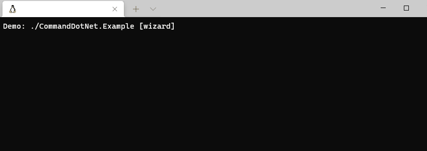

#  PromptPlus # Wizard
[**Main PromptPlus.CommandDotNet**](ppluscmddotnet.md#help) | 
[**Main PromptPlus Controls**](index.md)

## Wizard
Find all the commands/options and arguments with prompt and run. Now you can discover and learn the existing commands, options and arguments.

[**Top**](#-promptplus--wizard)

