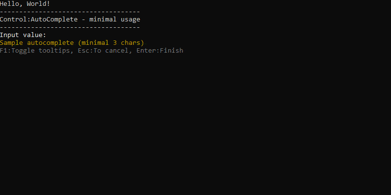

#  PromptPlus # AutoComplete
[**Main**](index.md#help) | 
[**Controls**](index.md#apis) |
[**ResultPromptPlus**](resultpromptplus) |
[**Base Methods**](basemethods) |
[**Pipe Methods**](pipemethods)


## Documentation
Control AutoComplete. Generic input with sugestions, validator and tooltips.



### Syntax
[**Top**](#promptplus--autocomplete)

```csharp
AutoComplete(string prompt = null)
```

### Methods
[**Top**](#promptplus--autocomplete)

- ```csharp
  Prompt(string value)
  ``` 
  - set prompt message 
- ```csharp
  ValidateOnDemand()
  ``` 
    - Run the validators on each interaction
- ```csharp
  Addvalidator(Func<object, ValidationResult> validator);
  ``` 
    - item of input validator.
- ```csharp
  Addvalidators(IEnumerable<Func<object, ValidationResult>> validators)
  ``` 
    - List of input validator
- ```csharp
  PageSize(int value)
  ```
    - Maximum item per page. If the value is ommited, the value will be calculated according to the screen size
- ```csharp
  SpeedAnimation(int value)
  ``` 
  - Animation speed.If value < 10, value = 10. If value > 1000, value = 1000.
- ```csharp
  MinimumPrefixLength(int value)
  ``` 
  - Minimum number of characters that must be entered before getting suggestions.
- ```csharp
  CompletionInterval(int value)
  ``` 
  - Time in milliseconds when the timer will kick in to get suggestions.
- ```csharp
  CompletionMaxCount(int value)
  ``` 
  - Number of suggestions to be retrieved.
- ```csharp
  CompletionAsyncService(Func<string,int,CancellationToken, Task<string[]>> value);
  ``` 
  - service function to be called to get suggestions.

### Return
[**Top**](#promptplus--autocomplete)


```csharp
IControlAutoComplete         //for Control Methods
IPromptControls<string>      //for others Base Methods
ResultPromptPlus<string>     //for Base Method Run, when execution is direct 
IPromptPipe                  //for Pipe condition and transform to IFormPlusBase 
IFormPlusBase                //for only definition of pipe to Pipeline Control
```

### Sample
[**Top**](#promptplus--autocomplete)
```csharp
private async Task<string[]> MYServiceCompleteAsync(string prefixText, int count, CancellationToken cancellationToken)
{
    if (count == 0)
    {
        count = 10;
    }
    var random = new Random();
    var items = new List<string>(count);
    for (var i = 0; i < count; i++)
    {
        var c1 = (char)random.Next(65, 90);
        var c2 = (char)random.Next(97, 122);
        var c3 = (char)random.Next(97, 122);

        items.Add(prefixText + c1 + c2 + c3);
    }
    return await Task.FromResult(items.ToArray());
}
```

```csharp
var input = PromptPlus.AutoComplete("Input value")
    .Addvalidator(PromptValidators.Required())
    .Addvalidator(PromptValidators.MinLength(3))
    .CompletionInterval(1000)
    .CompletionMaxCount(10)
    .PageSize(5)
    .CompletionAsyncService(MYServiceCompleteAsync);
    .Run(_stopApp);
if (input.IsAborted)
{
    return;
}
PromptPlus.WriteLine($"Result : [cyan]{input.Value}[/cyan]!");
```

### Links
[**Main**](index.md#help) | 
[**Controls**](index.md#apis) |
[**ResultPromptPlus**](resultpromptplus) |
[**Base Methods**](basemethods) |
[**Pipe Methods**](pipemethods)
