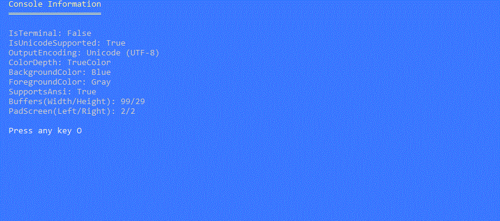
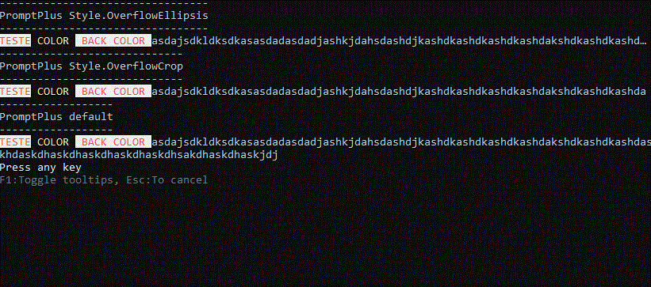
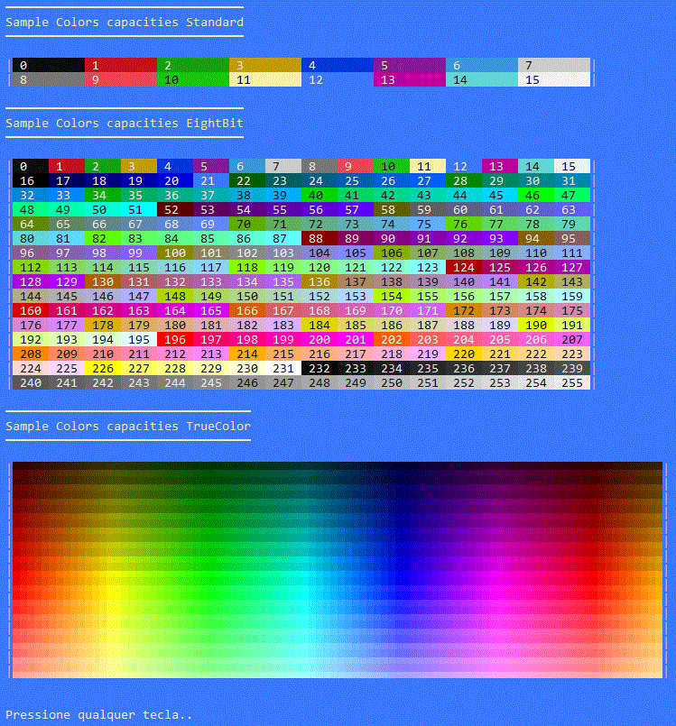

# Welcome to PromptPlus

[](https://github.com/FRACerqueira/PromptPlus/actions/workflows/build.yml)
[](https://github.com/FRACerqueira/PromptPlus/actions/workflows/publish.yml)
[](https://github.com/FRACerqueira/PromptPlus/blob/master/LICENSE)
[](https://www.nuget.org/packages/PromptPlus/)
[](https://www.nuget.org/packages/PromptPlus/)

**PromptPlus** was developed in c# with the **netstandard2.1**, **.Net 6** and **.Net 7** target frameworks.


## Table of Contents

- [Features](#features)
- [Migrate Version](migrateversion.md)
- [Installing](#installing)
- [Examples](#examples)
- [Controls Snapshot](snapshot.md)
- [Console Engine](#console-engine)
- [Culture](#culture)
- [Colors](#colors)
- [Hotkeys](#hotkeys)
- [Validators](#validators)
- [Global Settings](globalsettings.md)
- [API Reference](./apis/apis.md)
- [Supported Platforms](#supported-platforms)

## Features
[**Top**](#welcome-to-promptplus)
 
**_All features have IntelliSense_. The PromptPlus have more 20 controls with many features like: filters, validators, history, sugestions, spinner(19 embeding type and plus custom yours!), colors and styles for control-elements** :
- Banner Ascii
- Input text / Secret / AutoComplete with spinner
- MaskEdit Generic / Only Date / Only Time / DateTime / Number /  Currency
- Select and Multi-Select(with group select!) 
- AddTo(Add/Remove) items for text and masked text
- Wait Keypress with animate spinner
- Slider numeric ranger with gradient colors
- Up-Down numeric ranger 
- Switch (style on/off)
- Wait Process (Run background tasks Sequential/Parallel) with elapsedtime and spinner 
- Wait Time with countdown and spinner
- Progress bar with 8 types , gradient colors and spinner
- Browser File and Folder with multi-select, colors and spinner
- Treeview hierarchical structures with multi-select and colors

**All controls** have the same organization (see in action: [**Controls Snapshot**](snapshot.md)):
- input/filter (except Masked input) using **[GNU Readline](https://en.wikipedia.org/wiki/GNU_Readline) Emacs keyboard shortcuts**.  
- Prompt, description and data entry (ever)
- Extra actions per stage : OnStartControl/OnInputRender/OnTryAcceptInput/OnFinishControl (ever)
- Tooltips (ever and configurable) 
- Filter by Contains / StartsWith (configurable) (depends on the control)
- Collection subset items and interations (depends on the control)
- Page information and page-size(depends on the control)
- Spinner animmation (depends on the control)
- Error message (depends on the control and validators)

All controls use **fluent interface**. A is an object-oriented API whose design relies extensively on method chaining. Its goal is to increase code legibility. The term was coined in 2005 by Eric Evans and Martin Fowler.

```csharp
//MaskEdit Generic
var mask = PromptPlus.MaskEdit("input", "MaskEdit Generic input")
    .Mask(@"\XYZ 9{3}-L{3}-C[ABC]N{1}[XYZ]-A{3}")
    .DescriptionWithInputType(FormatWeek.Short)
    .Run();
```

PromptPlus driver console  **Supports 4/8/24-bit colors** in the terminal with **auto-detection** of the current terminal's capabilities.

## Migrate Version
[**Top**](#welcome-to-promptplus)

Until version 3 the console engine was based on a model from another project that has several serious problems that cause exceptions during execution in addition to increasing the complexity of the code for correct rendering...
**PromptPlus v4** has been **completely rebuilt** for a better experience, with significant improvements with new controls and more developer power. The console driver now supports better rendering, with the ability to detect terminal capabilities and allow for 24-bit color, text overflow strategies based on terminal size, and left and right margins for a nicer layout.
**The Controls have been revised to be more responsive, allow color styles in many of their elements**, and adapt to the terminal size even with resizing.
All these improvements were only possible by generating some **break-changes**, but maintaining a high sixtax compatibility.

For migrate V3 to V4 [**see this link**](migrateversion.md).


## Installing
[**Top**](#welcome-to-promptplus)

PromptPlus was developed in c# with the **netstandard2.1, .NET 6 AND .NET7** target frameworks.

```
Install-Package PromptPlus [-pre]
```

```
dotnet add package PromptPlus [--prerelease]
```

**_Note:  [-pre]/[--prerelease] usage for pre-release versions_**

## Examples
[**Top**](#welcome-to-promptplus)

The folder at github [**Samples**](https://github.com/FRACerqueira/PromptPlus/tree/Samples) contains more **30** samples!.

```
dotnet run --project [name of sample]
```

## Console Engine
[**Top**](#welcome-to-promptplus)

The console driver have the ability to detect terminal capabilities and allow for **24-bit color and text overflow strategies**  based on terminal size, and left and right margins for a nicer layout.
The new engine detects support ansi commands and adjust output for this functionality respecting OS differences , terminal mode and Windows console mode. The Colors are automatically adjusted to the capacity of the terminal. This automatic adjustment may slightly modify the final color when converting to a lower bit resolution.

### Wrap to Console - Code sample 

The PromptPlus have wrap from console for key features **cross-plataform**.

```csharp
//Console.CursorLeft = 1;
PromptPlus.CursorLeft = 1;
//Console.ReadKey();
PromptPlus.ReadKey();
```

### Extra commands to Console
- Clear(Color? backcolor = null)
  - Clear console with color and set BackgroundColor with color.
- ClearLine(int? row = null, Style? style = null) 
  - Clear row line with style 
- ClearRestOfLine(Style? style = null)
  - Clear rest of line
- WriteLines(int steps = 1)
  - write many new lines
- SingleDash(string value, DashOptions dashOptions = DashOptions.AsciiSingleBorder, int extralines = 0, Style? style = null)
  - Writes Write single dash after.
- DoubleDash(string value, DashOptions dashOptions = DashOptions.AsciiSingleBorder, int extralines = 0, Style? style = null)
  - Writes a pair of lines of dashes.
- MoveCursor(CursorDirection direction, int steps)
  - Move cursor by direction
- WaitKeypress(bool intercept, CancellationToken? cancellationToken)
  - Wait a keypress with cancelation token
- ReadLineWithEmacs(uint? maxlenght = uint.MaxValue,Action<string,int> afteraccept = null, CaseOptions caseOptions = CaseOptions.Any)
  - Read line from stream using Emacs keyboard shortcuts with maxlenght, case options and user action after each accepted keystroke

### Extend Write / Writeline
- Write(string value, Style? style = null, bool clearrestofline = false)
    -  Write a text to output console with options for style and clear rest of line  
- Write(Exception value, Style? style = null, bool clearrestofline = false)
    -  Write a Exception to output console with options for style and clear rest of line  
- WriteLine(string? value = null, Style? style = null, bool clearrestofline = true)
    -  Write a text to output console with line terminator, option for style and clear rest of line (default)
- WriteLine(Exception value, Style? style = null, bool clearrestofline = true)
    -  Write a exception to output console with line terminator, option for style and clear rest of line (default)

### Setup and auto detect - Code sample 

```csharp
PromptPlus.Setup((cfg) =>
{
    cfg.PadLeft = 2;
    cfg.PadRight = 2;
    cfg.Culture = new CultureInfo("en-us");
    cfg.BackgroundColor = ConsoleColor.Blue;
});
PromptPlus.SingleDash($"[yellow]Console Information[/]", DashOptions.DoubleBorder, 1 /*extra lines*/);
PromptPlus.WriteLine($"IsTerminal: {PromptPlus.IsTerminal}");
PromptPlus.WriteLine($"IsUnicodeSupported: {PromptPlus.IsUnicodeSupported}");
PromptPlus.WriteLine($"OutputEncoding: {PromptPlus.OutputEncoding.EncodingName}");
PromptPlus.WriteLine($"ColorDepth: {PromptPlus.ColorDepth}");
PromptPlus.WriteLine($"BackgroundColor: {PromptPlus.BackgroundColor}");
PromptPlus.WriteLine($"ForegroundColor: {PromptPlus.ForegroundColor}");
PromptPlus.WriteLine($"SupportsAnsi: {PromptPlus.SupportsAnsi}");
PromptPlus.WriteLine($"Buffers(Width/Height): {PromptPlus.BufferWidth}/{PromptPlus.BufferHeight}");
PromptPlus.WriteLine($"PadScreen(Left/Right): {PromptPlus.PadLeft}/{PromptPlus.PadRight}\n");

PromptPlus
    .KeyPress()
    .Config(cfg =>
    {
        cfg.HideAfterFinish(true)
          .ShowTooltip(false) 
          .ApplyStyle(StyleControls.Tooltips,Style.Plain.Foreground(Color.Grey100));
    }) 
    .Spinner(SpinnersType.Balloon)
    .Run();
    
```

### Output detect



### Overflow Capacity - Code sample 

```csharp
PromptPlus.Clear();
PromptPlus.DoubleDash($"PromptPlus.Console Style.OverflowEllipsis");
PromptPlus.WriteLine("[RED ON WHITE]TESTE[YELLOW] COLOR [/] BACK COLOR [/]" + 
"asdajsdkldksdkasasdadasdadjashkjdahsdashdjkashdkashdkashdkashdakshdkashdkashdaskhdaskdhaskdhaskdhaskdhaskdhsakdhaskdhaskjdj", style: Style.OverflowEllipsis);

PromptPlus.DoubleDash($"PromptPlus.Console Style.OverflowCrop");
PromptPlus.WriteLine("[RED ON WHITE]TESTE[YELLOW] COLOR [/] BACK COLOR [/]" + 
"asdajsdkldksdkasasdadasdadjashkjdahsdashdjkashdkashdkashdkashdakshdkashdkashdaskhdaskdhaskdhaskdhaskdhaskdhsakdhaskdhaskjdj", style: Style.OverflowCrop);

PromptPlus.DoubleDash($"PromptPlus.Console default");
PromptPlus.WriteLine("[RED ON WHITE]TESTE[YELLOW] COLOR [/] BACK COLOR [/]" + 
"asdajsdkldksdkasasdadasdadjashkjdahsdashdjkashdkashdkashdkashdakshdkashdkashdaskhdaskdhaskdhaskdhaskdhaskdhsakdhaskdhaskjdj");

PromptPlus
    .KeyPress()
    .Config(cfg => cfg.HideAfterFinish(true))
    .Spinner(SpinnersType.DotsScrolling)
    .Run();
```

### Output Overflow Capacity




#### Sample color capacity ([Projet sample](https://github.com/FRACerqueira/PromptPlus/tree/Samples/ConsoleFeaturesSamples))


**_Note: This layout and code was inspired by the excellent project:spectreconsole, having the same color palette_**




## Culture
[**Top**](#welcome-to-promptplus)

PromptPlus applies the language/culture **only when running controls**. The language/culture of the application is **not affected**. If language/culture is not informed, the application's language/culture will be used with fallback to en-US.

All messages are affected when changed language/culture. PromptPlus has languages embeded:
- en-US (Default)
- pt-BR
 
```csharp
//sample global set for messages and validate
PromptPlus.DefaultCulture = new CultureInfo("en-US");
```

```csharp
//sample only control
PromptPlus.MaskEdit("input", "MaskEdit DateOnly input")
    .Mask(MaskedType.DateOnly)
    .DescriptionWithInputType(FormatWeek.Short)
    .Culture(new CultureInfo("en-us")) //overwrite culture
    .AcceptEmptyValue()
    .Run();

PromptPlus.MaskEdit("input", "MaskEdit DateOnly input")
    .Mask(MaskedType.DateOnly)
    .DescriptionWithInputType(FormatWeek.Short)
    .Culture("pt-br") //overwrite culture
    .AcceptEmptyValue()
    .Run();
```

To use a non-embedded language/culture:

- Copy the **PromptPlusResources.resx** file in folder PromptPlus/Resources
- Translate messages with same format to your language/culture
- Convert .resx files to binary .resources files ([**reference link here**](https://docs.microsoft.com/en-us/dotnet/core/extensions/work-with-resx-files-programmatically))
- Publish the compiled file (**PromptPlus.[Language].resources**) in the same folder as the binaries.

## Colors
[**Top**](#welcome-to-promptplus)

PromptPlus is in accordance with informal standard [**NO COLOR**](https://no-color.org/). when there is the environment variable "no_color" the colors are disabled.

Prompt Plus also has commands for coloring parts of the text.

#### Direct console
```csharp
PromptPlus.WriteLine("[RGB(255,0,0) ON WHITE]Test[YELLOW] COLOR [/] BACK COLOR [/] other text");
PromptPlus.WriteLine("[#ff0000 ON WHITE]Test [YELLOW] COLOR [/] BACK COLOR [/] other text");
PromptPlus.WriteLine("[RED ON WHITE]Test[YELLOW] COLOR [/] BACK COLOR [/] other text");
````

### Using Style

```csharp
PromptPlus.WriteLine("Test", new Style(Color.White, Color.Red, Overflow.None));
PromptPlus.WriteLine("Test", new Style(new Color(255, 255, 255), Color.Red, Overflow.None));
PromptPlus.WriteLine("Test", new Style(Color.FromConsoleColor(ConsoleColor.White), Color.Red, Overflow.None));
PromptPlus.WriteLine("Test", new Style(Color.FromInt32(255), Color.Red, Overflow.None));
````

### Over controls
```csharp
PromptPlus
    .Input("Input [blue]sample2[/]", "with [yellow]description[/]")
    .Run();
````

### Escaping format characters
To output a [ you use [[, and to output a ] you use ]].
```csharp
PromptPlus.WriteLine("[[Test]]");
````

Promptplus uses the **same default colors and engine(softly modified)** as the third party project: spectreconsole.

[**Default color for controls and console**](colors.md)

## Hotkeys
[**Top**](#welcome-to-promptplus)

Hotkeys (global and control-specific) are configurable.

 ```csharp
//sample global
PromptPlus.Config.SelectAllPress = new HotKey(UserHotKey.F7);
```

[**Default Hotkeys for controls**](hotkeys.md)

## Validators
[**Top**](#welcome-to-promptplus)

PromptPlus have a lot extensions to **commons validator** and **validator import**(No duplicate code!) 

For more details see [**List validators embeding**](./apis/pplus.controls.promptvalidators.md)

```csharp
private class MylCass
{
    [Required(ErrorMessage = "{0} is required!")]
    [MinLength(3, ErrorMessage = "Min. Length = 3.")]
    [MaxLength(5, ErrorMessage = "Max. Length = 5.")]
    [Display(Prompt ="My Input")]
    public string MyInput { get; set; }
}
```
```csharp
var inst = new MylCass();

PromptPlus
    .Input("Input sample2", "import validator from decorate")
    .Default(inst.Text)
    .AddValidators(PromptValidators.ImportValidators(inst,x => x!.Text!))
    .Run();

if (name.IsAborted)
{
   return;
}
PromptPlus.WriteLine($"Your input: {name.Value}!");
```

```csharp
//sample
PromptPlus.EnabledAbortKey = false;
```

## Supported platforms
[**Top**](#welcome-to-promptplus)

- Windows
    - Command Prompt, PowerShell, Windows Terminal
- Linux (Ubuntu, etc)
    - Windows Terminal (WSL 2)
- macOS
    - Terminal.app
