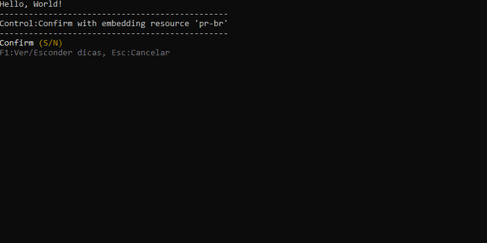

# Welcome to PromptPlus
[](https://www.nuget.org/packages/PromptPlus/)
[](https://www.nuget.org/packages/PromptPlus/)
[](https://github.com/FRACerqueira/PromptPlus/blob/master/LICENSE)

Interactive command-line based application framework for **C# with powerful controls**.

[**Snapshot of All Controls**](#snapshot)


## Help
- [Install](#install)
- [Organization](#organization)
    - [Pagination Behavior](#pagination-behavior)
- [Global Settings](#global-settings)
    - [Culture](#culture)
    - [Colors](#colors)
    - [Symbols](#symbols)
    - [Hotkeys](#hotkeys)
- [Load and Save Settings](#load-and-save-settings)
- [**Api Controls**](#apis)
- [**Extensions**](#extensions)
- [Snapshot of All Controls](#snapshot)
- [Supported Platforms](#supported-platforms)

# Documentation

## Install
[**Top**](#help)

PromptPlus was developed in c# with the **netstandard2.1, .NET 5 AND .NET6 ** target frameworks, with compatibility for:

- .NET Core 3.1
- .NET Core 5.0
- .NET Core 6.X

```
Install-Package PromptPlus [-pre]
```

```
dotnet add package PromptPlus [--prerelease]
```

**_Note:  [-pre]/[--prerelease] usage for pre-release versions_**

## Organization
[**Top**](#help)

All controls have the same lines organization:
- Message and data entry (ever)
- Filter (depends on the control)
- Tooltips (configurable)
- Collection subset items (depends on the control, page size and size of console/terminal)
- Page information (depends on size colletion, page size and size of console/terminal)
- Error message (depends on the control and validators)

tooltips can be global (hotkey always active - default F1) and control specific. All controls have the properties to show hide tooltips.

### Pagination Behavior
[**Top**](#help)

When a control has a collection it can be paged with a limit of items per page. When the item per page limit is not entered, the number of items per page is set to the maximum allowed by the console/terminal size. If the console/terminal is resized, an adjustment will be made to a number of items per page and a message will be issued on the console (only when it is a terminal)

## Global Settings
[**Top**](#help)

- EnabledBeep 
    - Enabled/disabled beep. Default = false
- EnabledStandardTooltip 
    - Show/Hide global tooltip. Default = true. When false then control´s tooltip not show.
- EnabledPromptTooltip
    - Enabled/disabled control´s tootip for default value. Default = true
- EnabledAbortKey
    - Enabled/disabled hotkey to abort prompt/control executation. Default = true
- EnabledAbortAllPipes 
    - Enabled/disabled hotkey to abort all pipes. Default = true
- PasswordChar 
    - Character default to password input. Default = '#'
- DefaultCulture 
    - Set default language/culture for all controls. Default = Current Culture application
 

```csharp
//sample
PromptPlus.EnabledAbortKey = false;
```

### Culture
[**Top**](#help)

PromptPlus applies the language/culture **only when running controls**. The language/culture of the application is **not affected**. If language/culture is not informed, the application's language/culture will be used with fallback to en-US.

All messages are affected when changed language/culture. PromptPlus has languages embeded:
- en-US (Default)
- pt-BR
 
```csharp
//sample
PromptPlus.DefaultCulture = new CultureInfo("en-US");
```

To use a non-embedded language/culture:

- Use the **PromptPlusResources.resx** file that already has the package in the resources folder
- Translate messages with same format to your language/culture
- Convert .resx files to binary .resources files ([**reference link here**](https://docs.microsoft.com/en-us/dotnet/core/extensions/work-with-resx-files-programmatically))
- Publish the compiled file (**PromptPlus.{Language}.resources**) in the same folder as the binaries.

### Colors
[**Top**](#help)

PromptPlus has a configurable color(16 color) schema.

- ForeColorSchema 
    - Screen foreground color. Default = Console.ForegroundColor
- BackColorSchema
    - Screen background color. Default = Console.BackgroundColor
- Pagination
    - Page info foreground color. Default = Console.DarkGray
- Hint
    - Hit/tooltip info foreground color. Default = Console.DarkGray
- Answer
    - Answer foreground color. Default = Console.Cyan
- Select
    - Seleted item foreground color. Default = Console.Green
- Disabled
    - Disabled item foreground color. Default = Console.DarkGray
- Filter
    - Filter info foreground color. Default = Console.Yellow
- Error
    - Error info foreground color. Default = Console.Red
- DoneSymbol
    - Done symbol foreground color. Default = Console.Cyan
- PromptSymbol
    - Prompt symbol foreground color. Default = Console.Green
- SliderBackcolor
    - Sliders / Progress bar background color. Default = Console.DarkGray
- SliderForecolor
    - Sliders / Progress bar foreground color. Default = Console.Cyan
 
 ```csharp
//sample
PromptPlus.ColorSchema.Answer = ConsoleColor.Cyan;
```

Prompt Plus also has commands for parts of text and underlining.

```csharp
//sample
PromptPlus.WriteLine("[cyan]This[/cyan] is a [white:blue]simples[/white:blue] line with [red!u]color[/red!u].");
````

```csharp
//sample
PromptPlus.WriteLine("This is a simples ","line".White().OnBlue().Underline(), " with ", "color".Red());
````

### Symbols
[**Top**](#help)

PromptPlus has a configurable symbols with Unicode support and Fallback.

- MaskEmpty
    - Symbol : ■
    - Fallback : double space
    - Apply to : Empty character for input masked
- File
    - Symbol : ■
    - Fallback : "- "
    - Apply to : Symbol for file in browser control
 - Folder
    - Symbol : ►
    - Fallback : "> "
    - Apply to : Symbol for folder in browser control
 - Prompt
    - Symbol : →
    - Fallback : "->"
    - Apply to : Symbol for prompt control
 - Done
    - Symbol : √
    - Fallback : "V "
    - Apply to : Symbol for prompt done
 - Error
    - Symbol : »
    - Fallback : "\>\>"
    - Apply to : Symbol for message error
 - Selector
    - Symbol : ›
    - Fallback : "> "
    - Apply to : Symbol for seletor item.
 - Selected
    - Symbol : ♦
    - Fallback : "* "
    - Apply to : Symbol for Selected item.
 - NotSelect
    - Symbol : ○
    - Fallback : double space
    - Apply to : Symbol for not Selected item.
 - TaskRun
    - Symbol : ♦
    - Fallback : "* "
    - Apply to : Symbol for backgound process running.
 - Skiped
    - Symbol : ×
    - Fallback : "x "
    - Apply to : Symbol for  backgound process canceled.

 ```csharp
//sample
PromptPlus.Symbols.Done = new Symbol("√", "V ");
```
**_Note: new Symbol() return : Symbol = single space and Fallback = double space._**

### Hotkeys
[**Top**](#help)

Hotkeys (global and control-specific) are configurable. Some hotkeys are internal and reserved.

**internal and reserved hotkeys:**

- Enter (all Modifiers)
- Delete (all Modifiers)
- LeftArrow (all Modifiers)
- RightArrow (all Modifiers)
- UpArrow (all Modifiers)
- DownArrow (all Modifiers)
- PageUp (all Modifiers)
- PageDown (all Modifiers)
- Backspace (all Modifiers)

**_Note: If you use one of these keys, an ArgumentException will be generated._**


**Hotkeys Configurables:**

- AbortAllPipesKeyPress
    - Key for abort all pipes. Default = Alt+X
- AbortKeyPress
    - Key for abort current control. Default = Escape
- TooltipKeyPress
    - Key for Show/Hide tooltips. Default = F1
- ResumePipesKeyPress
    - Key for Show/Hide summary pipes. Default = F2
- UnSelectFilter
    - Key for Show input filter. Default = Alt+F
- SwitchViewPassword
    - Key for Show/hide input password. Default = Alt+V
- SelectAll
    - Key for toggle all items to selected. Default = Alt+A
- InvertSelect
    - Key for invet selection to all items. Default = Alt+I
- RemoveAll
    - Key for remove all items. Default = Alt+R
 
 ```csharp
//sample
PromptPlus.AbortAllPipesKeyPress = new HotKey(key: "X", alt: true, ctrl: false, shift: false);
```

**_Note: the key parameter is case-insentive;_**

## Load and Save Settings
[**Top**](#help)

PromptPlus allows saving and loading a previous configuration of culture, behavior, hotkeys, colors and symbols.A file with the default configuration is available in the package in the Resources folder named **PromptPlus.config.json** . To load automatically the file must be placed in your project and published in the **same folder** as the binaries.

```csharp
//sample save
PromptPlus.SaveConfigToFile(folderfile: "YourFolder");
//sample load
PromptPlus.LoadConfigFromFile(folderfile: "YourFolder");
```

**_Note: if the folderfile parameter is omitted, it will be saved/loaded from the default application folder_**

## Apis
[**Top**](#help)

Controls/Commands | Details
--- | ---
[Commands](commands.md) |  Command set for PromptPlus console
[Color](colorcmd.md) | Easy to add some color-text and underline
[ASCII-Banner](banner.md) |  ASCII text banner 
[Any-key](anykey.md) |  Simple any key press
[Key-Press](keypress.md) | Simple specific key
[Confirm](confirm.md) | Simple confirm with  with tool tips and language detection 
[AutoComplete](autocomplete.md) | Input text with sugestions, validator, and tooltips 
[Input](input.md) | Input text with input validator with tooltips
[Password](input.md) | Input password with input validator and show/hide(optional) input value
[MaskEdit-Generic](maskeditgeneric.md) | Input with masked input , tooltips and input validator
[MaskEdit-Date](maskeditdate.md) | Date input with language parameter, tooltips and input validator
[MaskEdit-Time](maskeditdate.md) | Time input with language parameter, tooltips and input validator
[MaskEdit-Date/Time](maskeditdate.md) | Date and time input with language parameter, tooltips and input validator
[MaskEdit-Number](maskeditnumber.md) | Numeric input with language parameter, tooltips and input validator
[MaskEdit-Currency](maskeditnumber.md) | Currency input with language parameter, tooltips and input validator
[Select](select.md)| Generic select input IEnumerable/Enum with auto-paginator and tooltips and more
[MultiSelect](multiselect.md) | Generic multi select input IEnumerable/Enum with group, auto-paginator , tooltips and more
[List](list.md) | Create Generic IEnumerable with auto-paginator, tooptip , input validator, message error by type/format and more
[ListMasked](listmasked.md) | Create generic IEnumerable with maskededit, auto-paginator, tooptip , input validator
[Browser](browser.md) | Browser files/folder with auto-paginator and tooltips
[Slider-Number](slidernumber.md) | Numeric range with short/large step and tooltips
[Number-Up/Down](slidernumber.md) | Numeric range with step and tooltips
[Slider-Switch](sliderswitch.md) | Generic choice with customization and tooltips
[Progress-Bar](progressbar.md) | Progress Bar with interation customization
[Wait-Process](waitprocess.md) | Wait process with animation
[PipeLine](pipeline.md) | Pipeline sequence to all prompts with condition by pipe and status summary

## Extensions
[**Top**](#help)

PromptPlus have a extension to **import validators**. No duplicate code! 

```csharp
private class MylCass
{
    [Required(ErrorMessage = "{0} is required!")]
    [MinLength(3, ErrorMessage = "Min. Length = 3.")]
    [MaxLength(5, ErrorMessage = "Min. Length = 5.")]
    [Display(Prompt ="My Input")]
    public string MyInput { get; set; }
}
```
```csharp
var inst = new MylCass();
var name = PromptPlus.Input("Input Value for MyInput")
    .Addvalidators(inst.ImportValidators(x => x.MyInput))
    .Run(_stopApp);

if (name.IsAborted)
{
   return;
}
Console.WriteLine($"Your input: {name.Value}!");
```

## Snapshot

### Input
[**Top**](#help) | [AutoComplete](autocomplete.md) | [Input](input.md) | [Password](input.md) 


### MaskEdit
[**Top**](#help) | [MaskEdit Generic](maskeditgeneric.md) | [MaskEdit Date/Time](maskeditdate.md) | [MaskEdit Number/Currency](maskeditnumber.md) 


### KeyPress
[**Top**](#help) | [Any key](anykey.md) | [Key Press](keypress.md)


### Selectors
[**Top**](#help) | [Select](select.md) | [MultiSelect](multiselect.md)


### Confirm
[**Top**](#help) | [Confirm](confirm.md) | [Slider Switch](sliderswitch.md)




### WaitProcess
[**Top**](#help) | [WaitProcess](waitprocess.md) 


### ProgressBar
[**Top**](#help) | [Progress Bar](progressbar.md)


### Slider Number
[**Top**](#help) | [Slider Number](slidernumber.md) | [Number Up/Down](slidernumber.md)


### List
[**Top**](#help) | [List](list.md) | [ListMasked](listmasked.md)


### Browser
[**Top**](#help) | [Browser](browser.md)


### PipeLine
[**Top**](#help) | [PipeLine](pipeline.md)


### ASCII-Banner
[**Top**](#help) | [ASCII-Banner](banner.md)


### Colors
[**Top**](#help) | [Colors](colorcmd.md)


### Commands
[**Top**](#help) | [Commands](commands.md)


## Supported platforms
[**Top**](#help)

- Windows
    - Command Prompt, PowerShell, Windows Terminal
- Linux (Ubuntu, etc)
    - Windows Terminal (WSL 2)
- macOS
    - Terminal.app
