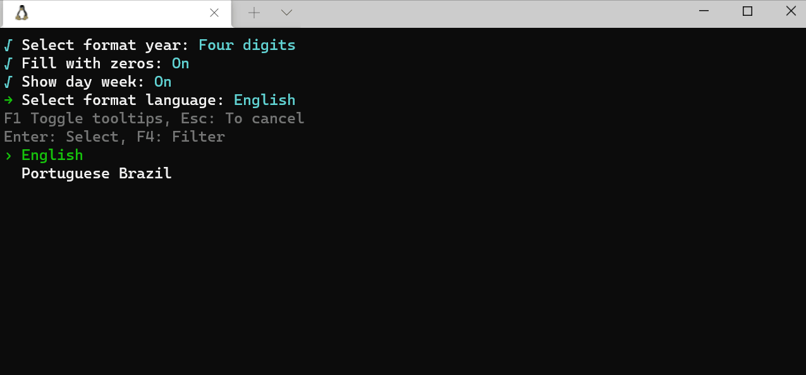
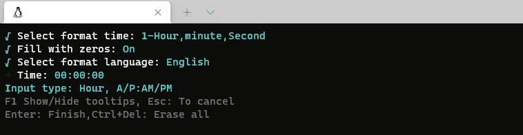

# PromptPlus # MaskEditDate
[**Main**](index.md#help) | 
[**Controls**](index.md#apis) |
[**ResultPPlus**](resultpplus) |
[**ResultMasked**](resultmasked)

## Documentation
Control MaskEdit. Date input with language parameter, tooltips and input validator.





### Options
Not have options

### Shortcuts

- If the Date Separator is typed, the cursor advances to the next part of the date
- If the Time Separator is typed, the cursor advances to the next part of the time

### Syntax
[**Top**](#promptplus--maskeditdate)

```csharp
MaskEdit(MaskedDateType masktype, string message, DateTime? defaultValue = null, CultureInfo cultureinfo = null, bool fillzeros = false, bool showtypeinput = true, FormatYear fyear = FormatYear.Y4, FormatTime ftime = FormatTime.HMS, IList<Func<object, ValidationResult>> validators = null, bool enabledPromptTooltip = true, bool enabledAbortKey = true, bool enabledAbortAllPipes = true, bool hideAfterFinish = false, CancellationToken? cancellationToken = null)
```

**Highlighted parameters**
- masktype = Must be MaskTypeDateOnly, MaskTypeTimeOnly or MaskTypeDateTime
- defaultValue = Initial value
- cultureinfo = Language/Culture of date. If null value, culture is DefaultCulture of PromptPlus.
- fillzeros = Fill input with zeros
- fyear = Format of year (2 or 4).
- ftime = Format of time (Hour:minute:second, Hour:minute:00, Hour:00:00). 
- showtypeinput = Show tooptip of type input 
- enabledAbortKey = Enabled/Disabled Hotkey AbortKeyPress
- enabledAbortAllPipes = Enabled/Disabled Hotkey AbortAllPipesKeyPress
- enabledPromptTooltip = Enabled/disabled control´s tootip
- hideAfterFinish = Hide result after finish

### Return
[**Top**](#promptplus--maskeditgeneric)

```csharp
ResultPPlus<ResultMasked>
```

### Sample
[**Top**](#promptplus--maskeditgeneric)

```csharp
var mask = PPlus.MaskEdit(PPlus.MaskTypeDateOnly, "Date",
                cultureinfo: new CultureInfo("en-US"),
                fyear: MaskedDatePlaceholder.Y4,
                FillZeros: true,
                cancellationToken: _stopApp);

if (string.IsNullOrEmpty(mask.Value.Input))
{
     Console.WriteLine($"your input was empty!");
}
else
{
     Console.WriteLine($"your input was {mask.Value.ObjectValue}!");
}
```

### Links
[**Main**](index.md#help) | 
[**Controls**](index.md#apis) |
[**ResultPPlus**](resultpplus) |
[**ResultMasked**](resultmasked)
