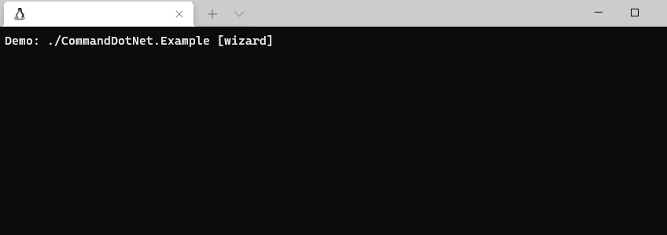
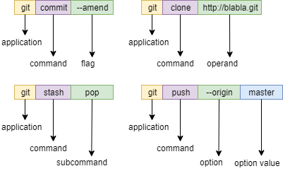

#  PromptPlus.CommandDotNet
[](https://www.nuget.org/packages/PromptPlusCommandDotNet/)
[](https://www.nuget.org/packages/PromptPlusCommandDotNet/)
[](https://github.com/FRACerqueira/PromptPlus/blob/master/LICENSE)

Interactive command-line based application framework for **C# with powerful controls** integrate command line parse **CommandDotNet(4.3.0/6.0.0)**
**PromptPlus** was developed in c# with the **netstandard2.1**, **.Net5** and **.Net6** target frameworks.


### **Official pages** :

#### **[Visit the official page for complete documentation of PromptPlus](https://fracerqueira.github.io/PromptPlus)**

#### **[CommandDotNet is third party applications. Visit official page for complete documentation](https://commanddotnet.bilal-fazlani.com)**

An open-source guide to help you write better command-line programs, taking traditional UNIX principles and updating them for the modern day.

#### **[Command Line Interface Guidelines](https://clig.dev/)**

## Snapshot of PromptPlus-Wizard using some PromptPlus-Attributes



## Help
- [Main PromptPlus](index.md#help)
- [Install](#install)
- [Sample](#sample)
- [Middlewares to CommandDotNet](#middlewares-to-commanddotnet)
- [**PromptPlus Wizard**](#promptplus-wizard)
- [**PromptPlus Attributes**](attributes.md)
- [**Extensions**](#extensions)
- [Supported Platforms](#supported-platforms)

## Install
[**Top**](#help)

**PromptPlus.CommandDotNet** was developed in c# with the **netstandard2.1** , **.NET 5** and **.NET6** target frameworks.

```
Install-Package PromptPlus.CommandDotNet [-pre]
```

```
dotnet add package PromptPlus.CommandDotNet [--prerelease]
```

**_Note:  [-pre]/[--prerelease] usage for pre-release versions_**

## Sample
[**Top**](#help)

```csharp
using System.Globalization;
using PPlus.CommandDotNet;
using CommandDotNet.NameCasing;
using System;
using PPlus;

namespace Example
{
    public class Program
    {
        static int Main(string[] args)
        {
            CultureInfo.DefaultThreadCurrentCulture = new CultureInfo("en-US");
            CultureInfo.DefaultThreadCurrentUICulture = new CultureInfo("en-US");

            PromptPlus.ConsoleDefaultColor(ConsoleColor.White, ConsoleColor.Black);
            PromptPlus.Clear();

            return new AppRunner<Examples>()
                .UseDefaultMiddleware()
                .UsePrompter()
                .UseNameCasing(Case.KebabCase)
                // will forward Out to the PromptPlus Console Driver
                .UsePromptPlusAnsiConsole()
                //Adds support for prompting arguments using PromptPlus-Controls
                .UsePromptPlusArgumentPrompter()
                // inject diretive [wizard] to discover and learn the existing commands, options and arguments with prompt and then run.
                .UsePromptPlusWizard() 
                .Run(args);
        }
    }
}
```

The GitHub'**PromptPlus** folder [**CommandDotNet.Example**]((https://github.com/FRACerqueira/PromptPlus)) contains all the samples built into [CommandDotNet](https://commanddotnet.bilal-fazlani.com)

```
dotnet run --project CommandDotNet.Example [wizard]
```
## Middlewares to CommandDotNet

### UsePromptPlusAnsiConsole
[**Top**](#help)

Forward Out to the **PromptPlus-Console Driver** with ansi terminal commands.

```csharp
UsePromptPlusAnsiConsole(this AppRunner appRunner, IConsoleDriver? ansiConsole = null)
```

- **IConsoleDriver**
    - Optionally, the IConsoleDriver to use else will use PromptPlus console driver

### UsePromptPlusArgumentPrompter
[**Top**](#help)

Adds support for prompting arguments using **PromptPlus-Controls**. By default, prompts for arguments missing a required value. Missing is determined by IArgumentArity.

```csharp
UsePromptPlusArgumentPrompter(this AppRunner appRunner,
            int pageSize = 5,
            Func<CommandContext, IArgument, string>? getPromptTextCallback = null,
            Predicate<IArgument>? argumentFilter = null)
```

- **pageSize**
    - The page size for selection lists.
- **getPromptTextCallback**
    - Used to customize the generation of the prompt text for CommandDotNet.
- **argumentFilter**
    - Filter the arguments that will be prompted. i.e. Create a [PromptWhenMissing] attribute, or only prompt for operands.Default filter includes only arguments where IArgumentArity.IArgumentArity.Minimum is greater than zero.


### UsePromptPlusConfig
[**Top**](#help)

Load custom config file (Colors/hotkeys/and so on) for PromptPlus. see in [**PromptPlus-Config**](index.md#load-and-save-settings)

```csharp
UsePromptPlusConfig(this AppRunner appRunner, string foldername)
```
- **foldername**
    - Required, the folder name where file **PromptPlus.config.json** is placed.

**_Note: This method is only necessary when the file is in a custom folder. Prompt Plus automatically loads the file if the file is placed in the same folder as the binaries._**

## PromptPlus Wizard
[**Top**](#help)

Directive to wizard find all the commands/options and arguments with prompt and then run.
**Now you can discover and learn the existing commands, options and arguments.**

[**CommandDotNet**](https://commanddotnet.bilal-fazlani.com) uses commands, options, and operands to define the execution of arguments passed by the command line. (
see the image below as an example)



This middleware **injects a directive** that allows you to branch execution to a discovery of each element of your command-line application, using a **step-by-step wizard using PromptPlus controls**.

### Syntax

```csharp
UsePromptPlusWizard(this AppRunner appRunner,
        string name = "wizard",
        int pageSize = 5,
        HotKey? runwizard = null,
        HotKey? backcommand = null,
        ConsoleColor? forecolorwizard=null,
        ConsoleColor? backcolorwizard = null,
        ConsoleColor? missingforecolorwizard = null)
```

- **name**
    - The name of diretive.
- **pageSize**
    - The page size for selection lists.
- **runwizard**
    - The hotkey to execute args from wizard. Default value : F5.
- **backcommand**
    - The hotkey to returns the wizard to the previous command. Default value : ConsoleKey.Backspace.
- **forecolorwizard**
    - The forecolor text for args to wizard. Default value : PPlus.PromptPlus.ColorSchema.Select (default Green)
- **backcolorwizard**
    - The backcolor text for args to wizard. Default value : PPlus.PromptPlus.BackgroundColor (default black)
- **missingforecolorwizard**
    - The forecolor text for operand missing to wizard. Default value : PPlus.PromptPlus.ColorSchema.Error (default red)

## Extensions

### CopyCallerDescription
[**Top**](#help)

Captures the description defined by the attribute defined in the calling method. Attributes must be of type INameAndDescription or DescriptionAttribute. 

```csharp
CopyCallerDescription(this object source, [CallerMemberName] string? caller = null)
```

##### Sample
```csharp
[Command(Description = "knock-knock joke, demonstrating use of IAnsiConsole")]
public void Choose(IConsoleDriver console, CancellationToken cancellationToken, int pageSize = 5)
{
    var answer = PromptPlus.Select<string>(
        "What is your favorite color ?", this.CopyCallerDescription()?? string.Empty)
            .PageSize(pageSize)
            .AddItems(new string[] { "blue", "purple", "red", "orange", "yellow", "green" })
            .Run(cancellationToken);
    if (answer.IsAborted)
    {
        console.WriteLine("Choose canceled");
    }
    else
    {
        console.WriteLine(answer.Value);
    }
}
```
## Supported platforms
[**Top**](#help)

- Windows
    - Command Prompt, PowerShell, Windows Terminal
- Linux (Ubuntu, etc)
    - Windows Terminal (WSL 2)
- macOS
    - Terminal.app
