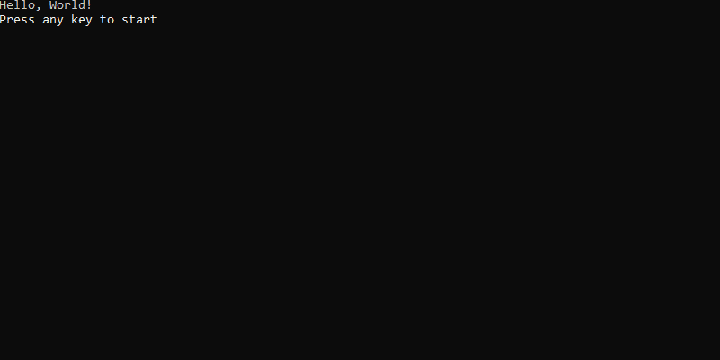

# PromptPlus # ProgressBar
[**Main**](index.md#help) | 
[**Controls**](index.md#apis) |
[**ResultPPlus**](resultpplus) |
[**ProgressBarInfo**](progressbarinfo) |
[**ProgressBar Options**](progressbaroptions) |
[**BaseOptions**](baseoptions)

## Documentation
Control ProgressBar. Progress Bar with interation customization.



### Options

[**ProgressBar Options**](progressbaroptions)

### Syntax
[**Top**](#promptplus--progressbar)

```csharp
Progressbar(ProgressBarOptions options, CancellationToken? cancellationToken = null)
Progressbar(Action<ProgressBarOptions> configure, CancellationToken? cancellationToken = null)
```

```csharp
ResultPPlus<ProgressBarInfo> Progressbar(string title, Func<ProgressBarInfo, CancellationToken, Task<ProgressBarInfo>> updateHandler,int width = 30, object interationId = null, CancellationToken? cancellationToken = null)
```

**Highlighted parameters**
- title = Title of progress bar 
- updateHandler = function that will be performed for each interaction
- interationId = identification last interaction. If null value, interationId = 0 (int)
- width = Width of Progressbar. If Width < 30, Width = 30.  If Width . 100, Width = 100

### Return
[**Top**](#promptplus--progressbar)

```csharp
ResultPPlus<ProgressBarInfo>
```

### Sample
[**Top**](#promptplus--progressbar)

```csharp
var progress = PPlus.Progressbar("Processing Tasks", UpdateSampleHandlerAsync, 0, cancellationToken: _stopApp);
if (progress.IsAborted)
{
   return;
}
Console.WriteLine($"Your result is: {progress.Value.Message}");
...
private async Task<ProgressBarInfo> UpdateSampleHandlerAsync(ProgressBarInfo status, CancellationToken cancellationToken)
{
   await Task.Delay(10);
   var aux = (int)status.InterationId + 1;
   var endupdate = true;
   if (aux < 100)
   {
      endupdate = false;
   }
   return new ProgressBarInfo(aux, endupdate, $"Interation {aux}", aux);
}
```

### Links
[**Main**](index.md#help) | 
[**Controls**](index.md#apis) |
[**ResultPPlus**](resultpplus) |
[**ProgressBarInfo**](progressbarinfo) |
[**ProgressBar Options**](progressbaroptions) |
[**BaseOptions**](baseoptions)
