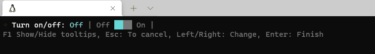

# PromptPlus # SliderSwitche
[**Main**](index.md#help) | 
[**Controls**](index.md#apis) |
[**ResultPromptPlus**](resultpromptplus) |
[**SliderSwitche Options**](sliderswitcheoptions) |
[**BaseOptions**](baseoptions)

## Documentation
Control SliderSwitche. Generic choice with customization and tooltips.



### Options

[**SliderSwitche Options**](sliderswitcheoptions)

### Syntax
[**Top**](#promptplus--sliderswitche)

```csharp
SliderSwitche(SliderSwitcheOptions options, CancellationToken? cancellationToken = null)
SliderSwitche(Action<SliderSwitcheOptions> configure, CancellationToken? cancellationToken = null)
```

```csharp
SliderSwitche(string message, bool value, string offvalue = null, string onvalue = null, CancellationToken? cancellationToken = null)
```

**Highlighted parameters**
- value = initial settings. IF value is true = onvalue, value is false = offvalue
- offvalue = value to off state. If value is null, value = OffValue in resx.
- onvalue = Value to on state. If value is null, value = OnValue in resx.

### Return
[**Top**](#promptplus--sliderswitche)

```csharp
ResultPromptPlus<bool>
```

### Sample
[**Top**](#promptplus--sliderswitche)

```csharp
var slider = PromptPlus.SliderSwitche("Turn on/off",false, cancellationToken: _stopApp);
if (slider.IsAborted)
{
    return;
}
Console.WriteLine($"Your answer is: {slider.Value}");
```

### Links
[**Main**](index.md#help) | 
[**Controls**](index.md#apis) |
[**ResultPromptPlus**](resultpromptplus) |
[**SliderSwitche Options**](sliderswitcheoptions) |
[**BaseOptions**](baseoptions)


