# PromptPlus Snapshot

[**Main**](index.md#table-of-contents)  

## Table of Contents

For each snapshot, the title is **name of projet** in folder at github [**Samples**](https://github.com/FRACerqueira/PromptPlus/tree/Samples).

- [Input - Basic](#input)
- [Input - AutoComplete](#autocomplete)
- [Input - MaskEdit](#maskedit)
- [Calendar](#calendar)
- [KeyPress & Confirm (yes/no style)](#keypress)
- [Select](#select)
- [Multi-Select](#multi-select)
- [Wait Process (Run background tasks Sequential/Parallel)](#wait-process)
- [Wait Time](#wait-time)
- [Chart Bar](#chart-bar)
- [Progress Bar](#progress-bar)
- [Slider Swith (on/off style)](#slider-swith)
- [Slider Number (vertical/Horizontal with bar)](#slider-number)
- [Add to List Basic/Masked](#add-to-list)
- [Browser Select file/folder](#browser-select)
- [Browser Multi-Select file/folder](#browser-multi-select)
- [TreeView Select](#treeview-select)
- [TreeView Multi-Select](#treeview-multi-select)
- [Banner - ASCII-ART](#banner)

### Input
[**Top**](#promptplus-snapshot) | [**Main**](index.md#table-of-contents)  

[InputBasicSamples](https://github.com/FRACerqueira/PromptPlus/tree/Samples/InputBasicSamples)

[InputSecretSamples](https://github.com/FRACerqueira/PromptPlus/tree/Samples/InputSecretSamples)

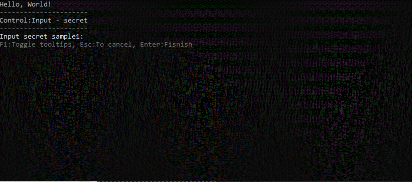

[InputWithHistorySamples](https://github.com/FRACerqueira/PromptPlus/tree/Samples/InputWithHistorySamples)

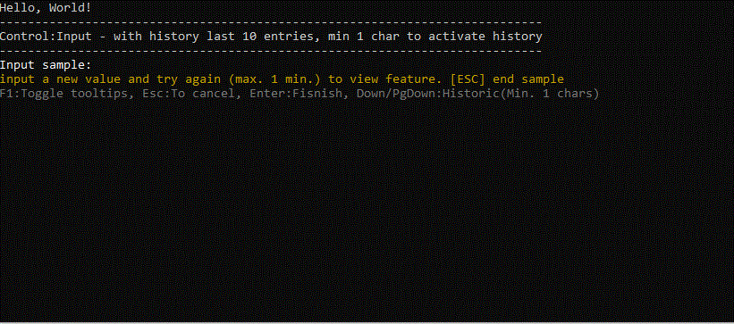

[InputWithSugestionSamples](https://github.com/FRACerqueira/PromptPlus/tree/Samples/InputWithSugestionSamples)

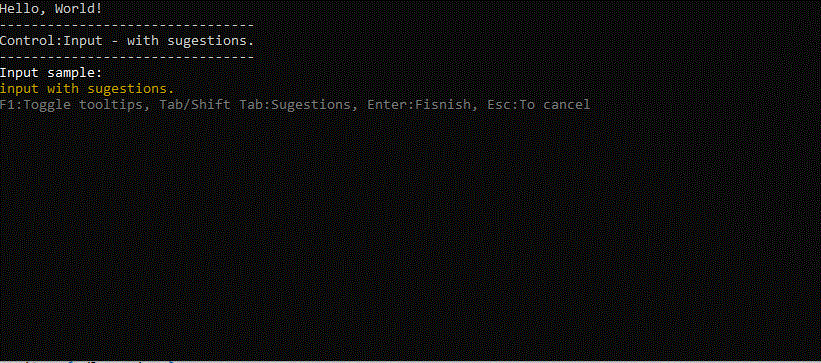

[InputWithValidatorSamples](https://github.com/FRACerqueira/PromptPlus/tree/Samples/InputWithValidatorSamples)

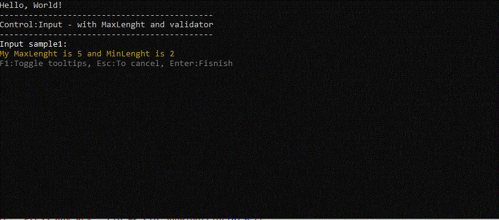

**Other samples input**

[InputOverwriteDefaultFromSamples](https://github.com/FRACerqueira/PromptPlus/tree/Samples/InputOverwriteDefaultFromSamples)

### Calendar
[**Top**](#promptplus-snapshot)  | [**Main**](index.md#table-of-contents)  

[CalendarSamples](https://github.com/FRACerqueira/PromptPlus/tree/Samples/CalendarSamples)

### AutoComplete
[**Top**](#promptplus-snapshot)  | [**Main**](index.md#table-of-contents)  

[AutoCompleteSamples](https://github.com/FRACerqueira/PromptPlus/tree/Samples/AutoCompleteSamples)

### MaskEdit
[**Top**](#promptplus-snapshot) | [**Main**](index.md#table-of-contents)  

[MaskEditGenericSamples](https://github.com/FRACerqueira/PromptPlus/tree/Samples/MaskEditGenericSamples)

[MaskEditDateTypeSamples](https://github.com/FRACerqueira/PromptPlus/tree/Samples/MaskEditDateTypeSamples)

[MaskEditTimeTypeSamples](https://github.com/FRACerqueira/PromptPlus/tree/Samples/MaskEditTimeTypeSamples)

[MaskEditDateTimeTypeSamples](https://github.com/FRACerqueira/PromptPlus/tree/Samples/MaskEditDateTimeTypeSamples)

[MaskEditNumberTypeSamples](https://github.com/FRACerqueira/PromptPlus/tree/Samples/MaskEditNumberTypeSamples)

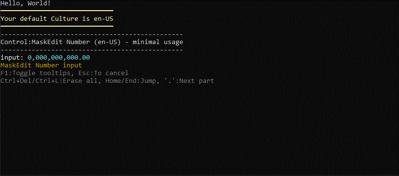

[MaskEditCurrencyTypeSamples](https://github.com/FRACerqueira/PromptPlus/tree/Samples/MaskEditCurrencyTypeSamples)

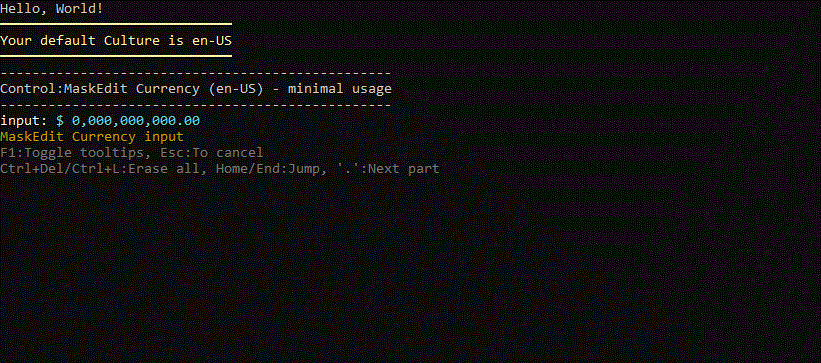

### KeyPress
[**Top**](#promptplus-snapshot) | [**Main**](index.md#table-of-contents)  

[KeyPressSamples](https://github.com/FRACerqueira/PromptPlus/tree/Samples/KeyPressSamples)

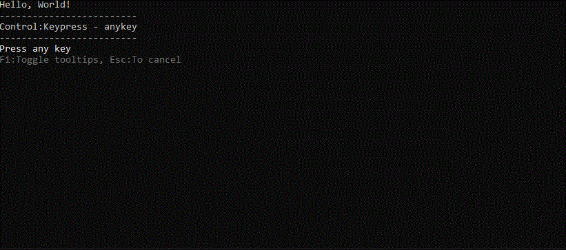

[ConfirmSamples](https://github.com/FRACerqueira/PromptPlus/tree/Samples/ConfirmSamples)

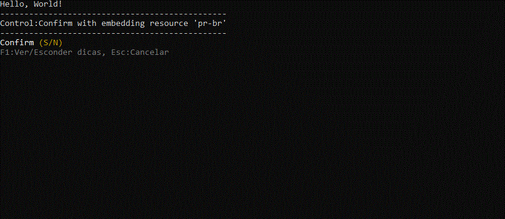

### Select
[**Top**](#promptplus-snapshot) | [**Main**](index.md#table-of-contents)  

[SelectBasicSamples](https://github.com/FRACerqueira/PromptPlus/tree/Samples/SelectBasicSamples)

**Other samples Select**

[SelectUserScopeSamples](https://github.com/FRACerqueira/PromptPlus/tree/Samples/SelectUserScopeSamples) ,
[SelectUserTypeSamples](https://github.com/FRACerqueira/PromptPlus/tree/Samples/SelectUserTypeSamples)

### Multi Select
[**Top**](#promptplus-snapshot) | [**Main**](index.md#table-of-contents)  

[MultiSelectBasicSamples](https://github.com/FRACerqueira/PromptPlus/tree/Samples/MultiSelectBasicSamples)

**Other samples Multi-Select**
[MultiSelectUserScopeSamples](https://github.com/FRACerqueira/PromptPlus/tree/Samples/MultiSelectUserScopeSamples) ,
[MultiSelectUserTypeSamples](https://github.com/FRACerqueira/PromptPlus/tree/Samples/MultiSelectUserTypeSamples)

### Wait Process
[**Top**](#promptplus-snapshot) | [**Main**](index.md#table-of-contents)  

[WaitTasksSamples](https://github.com/FRACerqueira/PromptPlus/tree/Samples/WaitTasksSamples)

### Wait Time
[**Top**](#promptplus-snapshot) | [**Main**](index.md#table-of-contents)  

[WaitTimerSamples](https://github.com/FRACerqueira/PromptPlus/tree/Samples/WaitTimerSamples)

### Chart Bar
[**Top**](#table-of-contents)

[ChartSamples](https://github.com/FRACerqueira/PromptPlus/tree/Samples/ChartSamples)

### Progress Bar
[**Top**](#promptplus-snapshot) | [**Main**](index.md#table-of-contents)  

[ProgressBarSamples](https://github.com/FRACerqueira/PromptPlus/tree/Samples/ProgressBarSamples)

### Slider Swith
[**Top**](#promptplus-snapshot) | [**Main**](index.md#table-of-contents)  

[SliderSwithSamples](https://github.com/FRACerqueira/PromptPlus/tree/Samples/SliderSwithSamples)

### Slider Number
[**Top**](#promptplus-snapshot) | [**Main**](index.md#table-of-contents)  

[SliderNumberUpDownModeSamples](https://github.com/FRACerqueira/PromptPlus/tree/Samples/SliderNumberUpDownModeSamples)

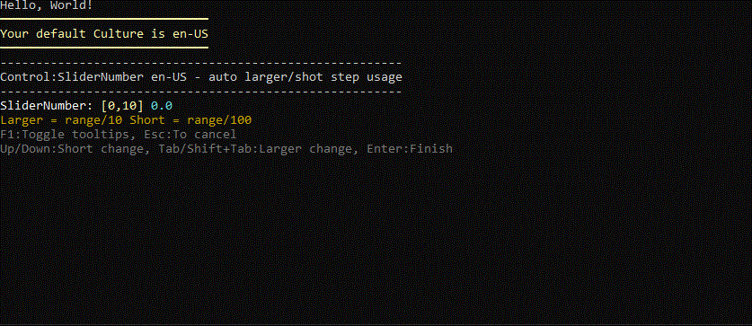

[SliderNumberLeftRightModeSamples](https://github.com/FRACerqueira/PromptPlus/tree/Samples/SliderNumberLeftRightModeSamples)

### Add to List
[**Top**](#promptplus-snapshot) | [**Main**](index.md#table-of-contents)  

[AddToListSamples](https://github.com/FRACerqueira/PromptPlus/tree/Samples/AddToListSamples)

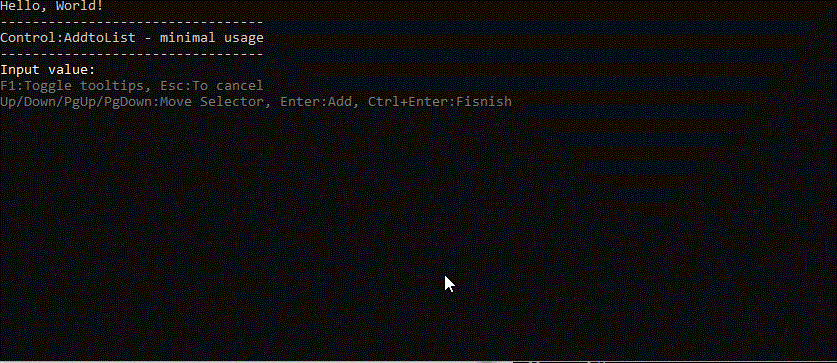

[AddtoMaskEditListSamples](https://github.com/FRACerqueira/PromptPlus/tree/Samples/AddtoMaskEditListSamples)

### Browser Select
[**Top**](#promptplus-snapshot) | [**Main**](index.md#table-of-contents)  

[BrowserSamples](https://github.com/FRACerqueira/PromptPlus/tree/Samples/BrowserSamples)

### Browser Multi Select
[**Top**](#promptplus-snapshot) | [**Main**](index.md#table-of-contents)  

[BrowserMultSelectSamples](https://github.com/FRACerqueira/PromptPlus/tree/Samples/BrowserMultSelectSamples)

### TreeView Select
[**Top**](#promptplus-snapshot) | [**Main**](index.md#table-of-contents)  

[TreeViewSamples](https://github.com/FRACerqueira/PromptPlus/tree/Samples/TreeViewSamples)

### TreeView Multi Select
[**Top**](#promptplus-snapshot) | [**Main**](index.md#table-of-contents)  

[TreeViewMultiSelectSamples](https://github.com/FRACerqueira/PromptPlus/tree/Samples/TreeViewMultiSelectSamples)

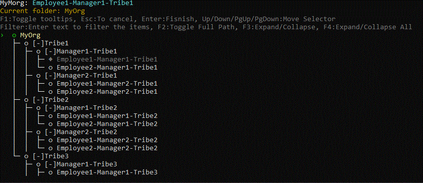

### Banner
[**Top**](#promptplus-snapshot) | [**Main**](index.md#table-of-contents)  

[BannerSamples](https://github.com/FRACerqueira/PromptPlus/tree/Samples/BannerSamples)

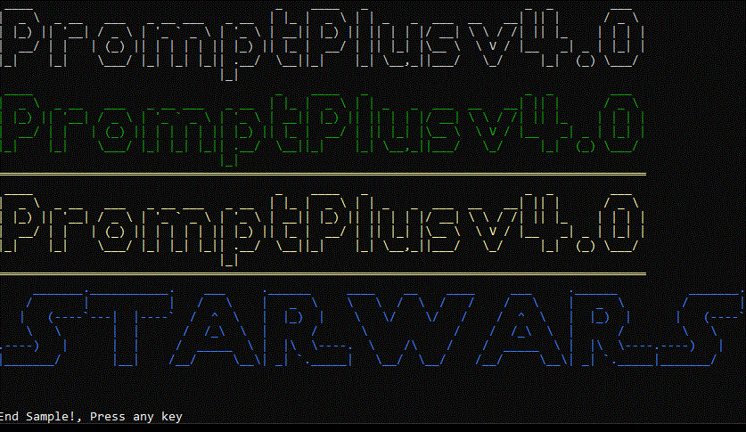

