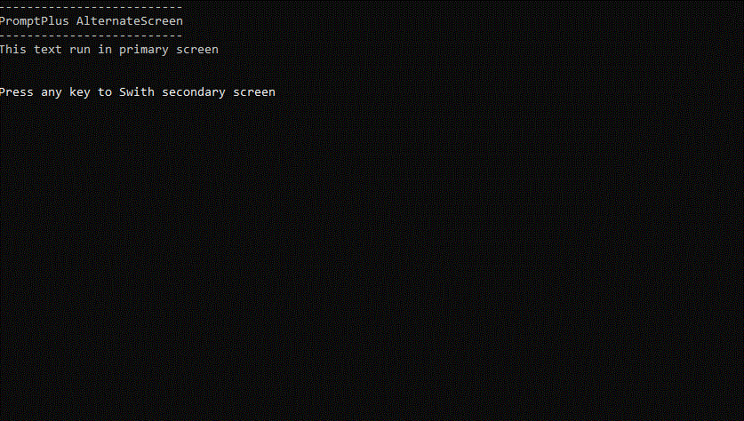

# PromptPlus Snapshot

[**Main**](index.md#table-of-contents)  

## Table of Contents

For each snapshot, the title is **name of project** in folder at github [**Samples**](https://github.com/FRACerqueira/PromptPlus/tree/main/Samples).

- [Table](#table)
- [Pipeline](#pipeline)
- [Alternate screen](#alternate-screen)
- [Input - Basic](#input)
- [Input - AutoComplete](#autocomplete)
- [Input - MaskEdit](#maskedit)
- [Calendar](#calendar)
- [KeyPress & Confirm (yes/no style)](#keypress)
- [Select](#select)
- [Multi-Select](#multi-select)
- [Wait Process (Run background tasks Sequential/Parallel)](#wait-process)
- [Wait Time](#wait-time)
- [Chart Bar](#chart-bar)
- [Progress Bar](#progress-bar)
- [Slider Switch (on/off style)](#slider-switch)
- [Slider Number (vertical/Horizontal with bar)](#slider-number)
- [Add to List Basic/Masked](#add-to-list)
- [Browser Select file/folder](#browser-select)
- [Browser Multi-Select file/folder](#browser-multi-select)
- [TreeView Select](#treeview-select)
- [TreeView Multi-Select](#treeview-multi-select)
- [Banner - ASCII-ART](#banner)

### Table

[**Top**](#promptplus-snapshot)  | [TableSamples](https://github.com/FRACerqueira/PromptPlus/tree/main/Samples/TableSamples)

### Pipeline

[**Top**](#promptplus-snapshot) | [**Main**](index.md#table-of-contents) | [PipelineSamples](https://github.com/FRACerqueira/PromptPlus/tree/main/Samples/PipelineSamples)

**Not have snapshot, view sample**

### Alternate screen

[**Top**](#promptplus-snapshot) | [**Main**](index.md#table-of-contents) | [AlternateScreenSamples](https://github.com/FRACerqueira/PromptPlus/tree/main/Samples/AlternateScreenSamples)

### Input

[**Top**](#promptplus-snapshot) | [**Main**](index.md#table-of-contents) | [InputBasicSamples](https://github.com/FRACerqueira/PromptPlus/tree/main/Samples/InputBasicSamples)

[**Top**](#promptplus-snapshot) | [**Main**](index.md#table-of-contents) | [InputSecretSamples](https://github.com/FRACerqueira/PromptPlus/tree/main/Samples/InputSecretSamples)

[**Top**](#promptplus-snapshot) | [**Main**](index.md#table-of-contents) | [InputWithHistorySamples](https://github.com/FRACerqueira/PromptPlus/tree/main/Samples/InputWithHistorySamples)

[**Top**](#promptplus-snapshot) | [**Main**](index.md#table-of-contents) | [InputWithSuggestionSamples](https://github.com/FRACerqueira/PromptPlus/tree/main/Samples/InputWithSuggestionSamples)

[**Top**](#promptplus-snapshot) | [**Main**](index.md#table-of-contents) | [InputWithValidatorSamples](https://github.com/FRACerqueira/PromptPlus/tree/main/Samples/InputWithValidatorSamples)

**Other samples input**

[**Top**](#promptplus-snapshot) | [**Main**](index.md#table-of-contents) | [InputOverwriteDefaultFromSamples](https://github.com/FRACerqueira/PromptPlus/tree/main/Samples/InputOverwriteDefaultFromSamples)

### Calendar

[**Top**](#promptplus-snapshot) | [**Main**](index.md#table-of-contents) | [CalendarSamples](https://github.com/FRACerqueira/PromptPlus/tree/main/Samples/CalendarSamples)

### AutoComplete

[**Top**](#promptplus-snapshot) | [**Main**](index.md#table-of-contents) | [AutoCompleteSamples](https://github.com/FRACerqueira/PromptPlus/tree/main/Samples/AutoCompleteSamples)

### MaskEdit

[**Top**](#promptplus-snapshot) | [**Main**](index.md#table-of-contents) | [MaskEditGenericSamples](https://github.com/FRACerqueira/PromptPlus/tree/main/Samples/MaskEditGenericSamples)

[**Top**](#promptplus-snapshot) | [**Main**](index.md#table-of-contents) | [MaskEditDateTypeSamples](https://github.com/FRACerqueira/PromptPlus/tree/main/Samples/MaskEditDateTypeSamples)

[**Top**](#promptplus-snapshot) | [**Main**](index.md#table-of-contents) | [MaskEditTimeTypeSamples](https://github.com/FRACerqueira/PromptPlus/tree/main/Samples/MaskEditTimeTypeSamples)

[**Top**](#promptplus-snapshot) | [**Main**](index.md#table-of-contents) | [MaskEditDateTimeTypeSamples](https://github.com/FRACerqueira/PromptPlus/tree/main/Samples/MaskEditDateTimeTypeSamples)

[**Top**](#promptplus-snapshot) | [**Main**](index.md#table-of-contents) | [MaskEditNumberTypeSamples](https://github.com/FRACerqueira/PromptPlus/tree/main/Samples/MaskEditNumberTypeSamples)

[**Top**](#promptplus-snapshot) | [**Main**](index.md#table-of-contents) | [MaskEditCurrencyTypeSamples](https://github.com/FRACerqueira/PromptPlus/tree/main/Samples/MaskEditCurrencyTypeSamples)

### KeyPress

[**Top**](#promptplus-snapshot) | [**Main**](index.md#table-of-contents) | [KeyPressSamples](https://github.com/FRACerqueira/PromptPlus/tree/main/Samples/KeyPressSamples)

[**Top**](#promptplus-snapshot) | [**Main**](index.md#table-of-contents) | [ConfirmSamples](https://github.com/FRACerqueira/PromptPlus/tree/main/Samples/ConfirmSamples)

### Select

[**Top**](#promptplus-snapshot) | [**Main**](index.md#table-of-contents) | [SelectBasicSamples](https://github.com/FRACerqueira/PromptPlus/tree/main/Samples/SelectBasicSamples)

**Other samples Select**

[**Top**](#promptplus-snapshot) | [**Main**](index.md#table-of-contents) | [SelectUserScopeSamples](https://github.com/FRACerqueira/PromptPlus/tree/main/Samples/SelectUserScopeSamples) ,
[SelectUserTypeSamples](https://github.com/FRACerqueira/PromptPlus/tree/main/Samples/SelectUserTypeSamples)

### Multi Select

[**Top**](#promptplus-snapshot) | [**Main**](index.md#table-of-contents) | [MultiSelectBasicSamples](https://github.com/FRACerqueira/PromptPlus/tree/main/Samples/MultiSelectBasicSamples)

**Other samples Multi-Select**
[**Top**](#promptplus-snapshot) | [**Main**](index.md#table-of-contents) | [MultiSelectUserScopeSamples](https://github.com/FRACerqueira/PromptPlus/tree/main/Samples/MultiSelectUserScopeSamples) ,
[MultiSelectUserTypeSamples](https://github.com/FRACerqueira/PromptPlus/tree/main/Samples/MultiSelectUserTypeSamples)

### Wait Process

[**Top**](#promptplus-snapshot) | [**Main**](index.md#table-of-contents) | [WaitTasksSamples](https://github.com/FRACerqueira/PromptPlus/tree/main/Samples/WaitTasksSamples)

### Wait Time

[**Top**](#promptplus-snapshot) | [**Main**](index.md#table-of-contents) | [WaitTimerSamples](https://github.com/FRACerqueira/PromptPlus/tree/main/Samples/WaitTimerSamples)

### Chart Bar

[**Top**](#promptplus-snapshot) | [**Main**](index.md#table-of-contents) | [ChartSamples](https://github.com/FRACerqueira/PromptPlus/tree/main/Samples/ChartSamples)

### Progress Bar

[**Top**](#promptplus-snapshot) | [**Main**](index.md#table-of-contents) | [ProgressBarSamples](https://github.com/FRACerqueira/PromptPlus/tree/main/Samples/ProgressBarSamples)

### Slider Switch

[**Top**](#promptplus-snapshot) | [**Main**](index.md#table-of-contents) | [SliderSwitchSamples](https://github.com/FRACerqueira/PromptPlus/tree/main/Samples/SliderSwitchSamples)

### Slider Number

[**Top**](#promptplus-snapshot) | [**Main**](index.md#table-of-contents) | [SliderNumberUpDownModeSamples](https://github.com/FRACerqueira/PromptPlus/tree/main/Samples/SliderNumberUpDownModeSamples)

[**Top**](#promptplus-snapshot) | [**Main**](index.md#table-of-contents) | [SliderNumberLeftRightModeSamples](https://github.com/FRACerqueira/PromptPlus/tree/main/Samples/SliderNumberLeftRightModeSamples)

### Add to List

[**Top**](#promptplus-snapshot) | [**Main**](index.md#table-of-contents) | [AddToListSamples](https://github.com/FRACerqueira/PromptPlus/tree/main/Samples/AddToListSamples)

[**Top**](#promptplus-snapshot) | [**Main**](index.md#table-of-contents) | [AddtoMaskEditListSamples](https://github.com/FRACerqueira/PromptPlus/tree/main/Samples/AddtoMaskEditListSamples)

### Browser Select

[**Top**](#promptplus-snapshot) | [**Main**](index.md#table-of-contents) | [BrowserSamples](https://github.com/FRACerqueira/PromptPlus/tree/main/Samples/BrowserSamples)

### Browser Multi Select

[**Top**](#promptplus-snapshot) | [**Main**](index.md#table-of-contents) | [BrowserMultSelectSamples](https://github.com/FRACerqueira/PromptPlus/tree/main/Samples/BrowserMultSelectSamples)

### TreeView Select

[**Top**](#promptplus-snapshot) | [**Main**](index.md#table-of-contents) | [TreeViewSamples](https://github.com/FRACerqueira/PromptPlus/tree/main/Samples/TreeViewSamples)

### TreeView Multi Select

[**Top**](#promptplus-snapshot) | [**Main**](index.md#table-of-contents) | [TreeViewMultiSelectSamples](https://github.com/FRACerqueira/PromptPlus/tree/main/Samples/TreeViewMultiSelectSamples)

### Banner

[**Top**](#promptplus-snapshot) | [**Main**](index.md#table-of-contents) | [BannerSamples](https://github.com/FRACerqueira/PromptPlus/tree/main/Samples/BannerSamples)

