# PromptPlus Snapshot

[**Main**](index.md#table-of-contents)  

## Table of Contents

For each snapshot, the title is **name of project** in folder at github [**Samples**](https://github.com/FRACerqueira/PromptPlus/tree/main/Samples).

### AddToList

[**Top**](#table-of-contents)  | [Samples](https://github.com/FRACerqueira/PromptPlus/tree/main/Samples/AddToListSamples)

[**Top**](#table-of-contents)  | [Samples](https://github.com/FRACerqueira/PromptPlus/tree/main/Samples/AddtoMaskEditListSamples)

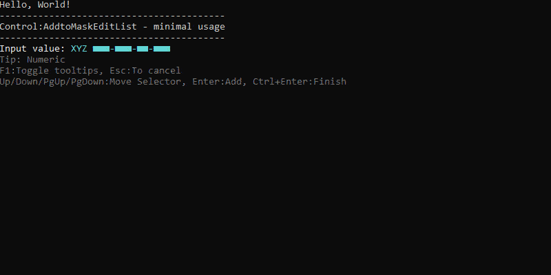

### AlternateScreen

[**Top**](#table-of-contents)  | [Samples](https://github.com/FRACerqueira/PromptPlus/tree/main/Samples/AlternateScreenSamples)

### AutoComplete

[**Top**](#table-of-contents)  | [Samples](https://github.com/FRACerqueira/PromptPlus/tree/main/Samples/AutoCompleteSamples)

### Banner

[**Top**](#table-of-contents)  | [Samples](https://github.com/FRACerqueira/PromptPlus/tree/main/Samples/BannerSamples)

### Browser

[**Top**](#table-of-contents)  | [Samples](https://github.com/FRACerqueira/PromptPlus/tree/main/Samples/BrowserMultSelectSamples)

[**Top**](#table-of-contents)  | [Samples](https://github.com/FRACerqueira/PromptPlus/tree/main/Samples/BrowserSamples)

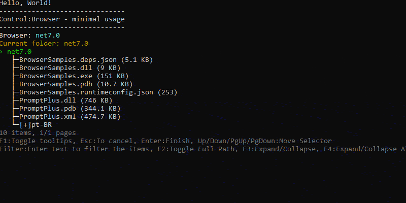

### Calendar

[**Top**](#table-of-contents)  | [Samples](https://github.com/FRACerqueira/PromptPlus/tree/main/Samples/CalendarSamples)

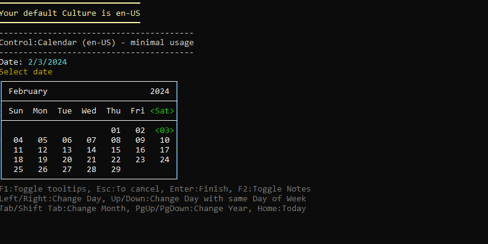

### ChartBar

[**Top**](#table-of-contents)  | [Samples](https://github.com/FRACerqueira/PromptPlus/tree/main/Samples/ChartSamples)

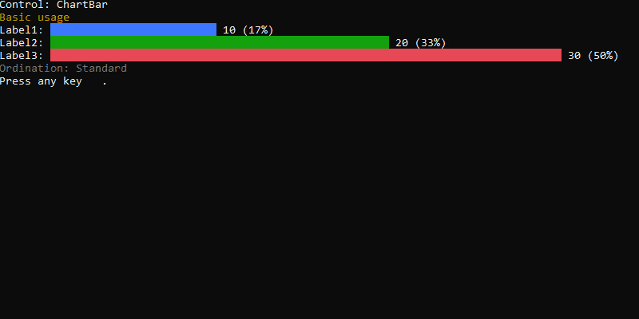

### Confirm

[**Top**](#table-of-contents)  | [Samples](https://github.com/FRACerqueira/PromptPlus/tree/main/Samples/ConfirmSamples)

### Console Features

[**Top**](#table-of-contents)  | [Samples](https://github.com/FRACerqueira/PromptPlus/tree/main/Samples/ConsoleFeaturesSamples)

### Input

[**Top**](#table-of-contents)  | [Samples](https://github.com/FRACerqueira/PromptPlus/tree/main/Samples/InputBasicSamples)

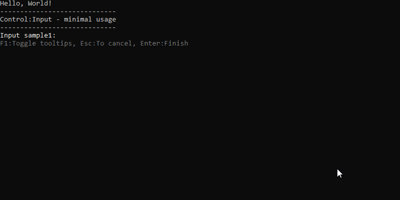

[**Top**](#table-of-contents)  | [Samples](https://github.com/FRACerqueira/PromptPlus/tree/main/Samples/InputSecretSamples)

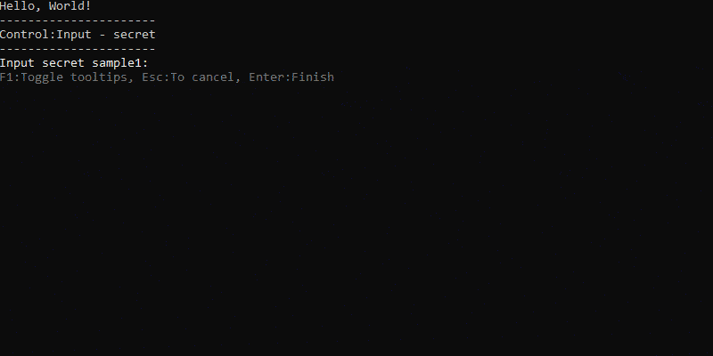

[**Top**](#table-of-contents)  | [Samples](https://github.com/FRACerqueira/PromptPlus/tree/main/Samples/InputWithHistorySamples)

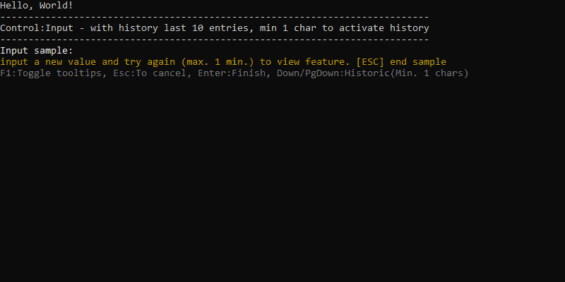

[**Top**](#table-of-contents)  | [Samples](https://github.com/FRACerqueira/PromptPlus/tree/main/Samples/InputWithSuggestionSamples)

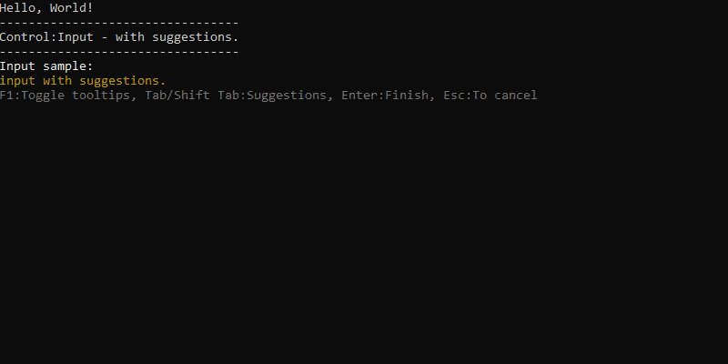

[**Top**](#table-of-contents)  | [Samples](https://github.com/FRACerqueira/PromptPlus/tree/main/Samples/InputWithValidatorSamples)

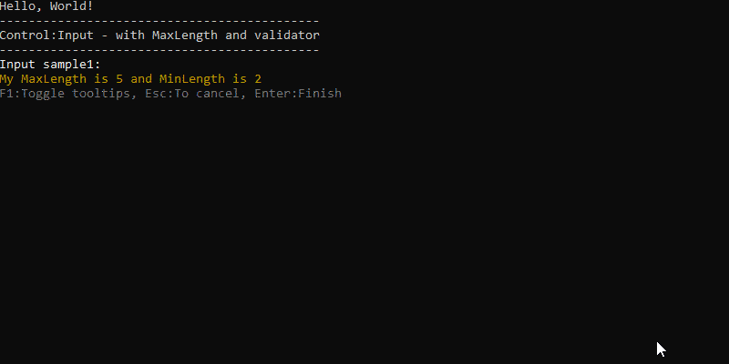

### KeyPress

[**Top**](#table-of-contents)  | [Samples](https://github.com/FRACerqueira/PromptPlus/tree/main/Samples/KeyPressSamples)

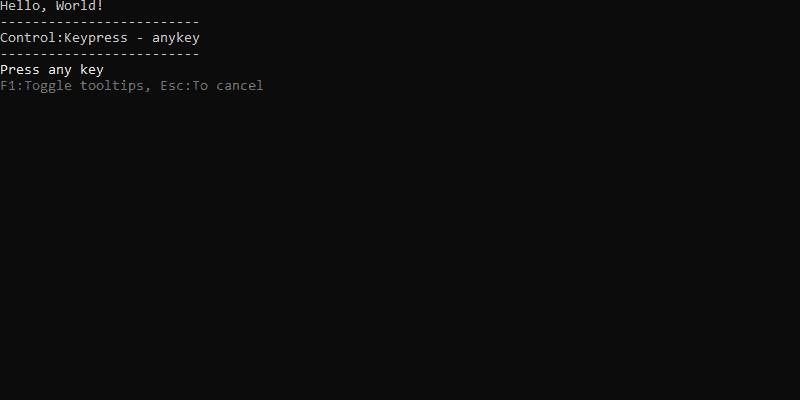

### MaskEdit

[**Top**](#table-of-contents)  | [Samples](https://github.com/FRACerqueira/PromptPlus/tree/main/Samples/MaskEditCurrencyTypeSamples)

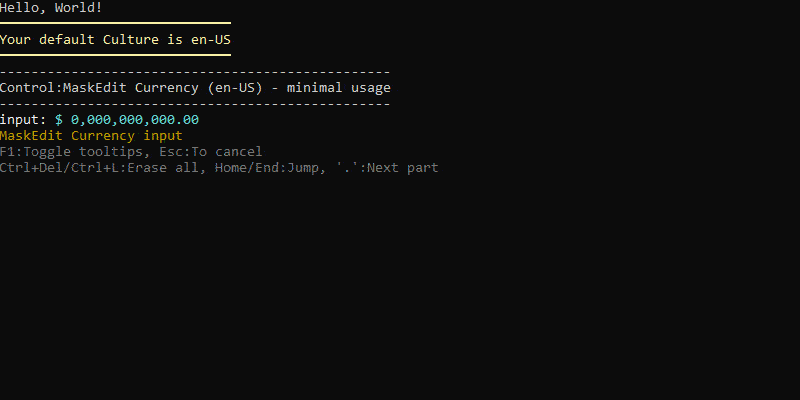

[**Top**](#table-of-contents)  | [Samples](https://github.com/FRACerqueira/PromptPlus/tree/main/Samples/MaskEditDateTimeTypeSamples)

[**Top**](#table-of-contents)  | [Samples](https://github.com/FRACerqueira/PromptPlus/tree/main/Samples/MaskEditGenericSamples)

[**Top**](#table-of-contents)  | [Samples](https://github.com/FRACerqueira/PromptPlus/tree/main/Samples/MaskEditNumberTypeSamples)

[**Top**](#table-of-contents)  | [Samples](https://github.com/FRACerqueira/PromptPlus/tree/main/Samples/MaskEditDateTypeSamples)

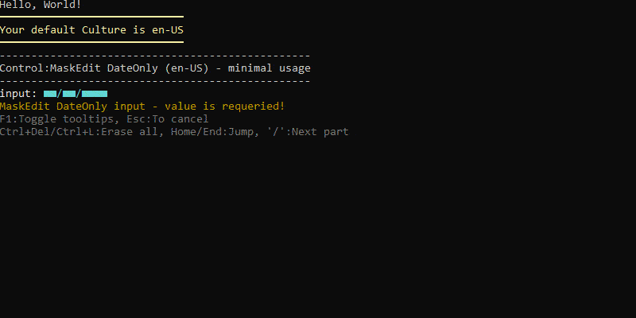

[**Top**](#table-of-contents)  | [Samples](https://github.com/FRACerqueira/PromptPlus/tree/main/Samples/MaskEditTimeTypeSamples)

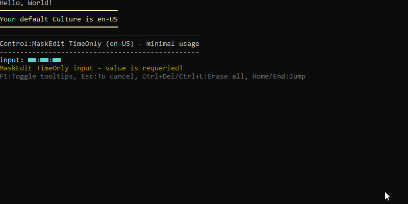

### MultSelect

[**Top**](#table-of-contents)  | [Samples](https://github.com/FRACerqueira/PromptPlus/tree/main/Samples/MultiSelectBasicSamples)

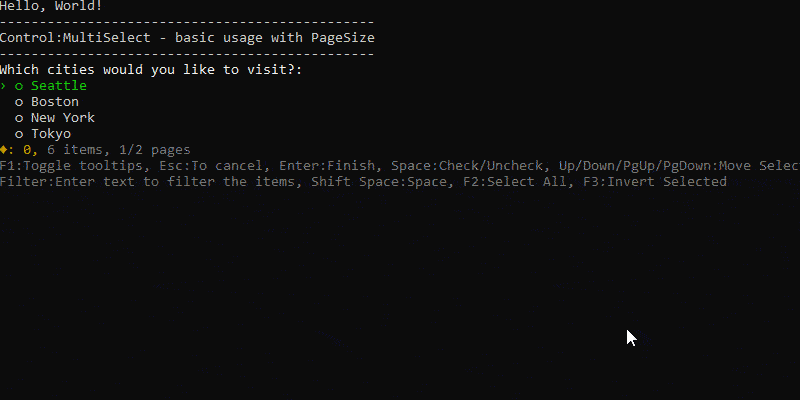

### ProgressBar

[**Top**](#table-of-contents)  | [Samples](https://github.com/FRACerqueira/PromptPlus/tree/main/Samples/ProgressBarSamples)

### Select

[**Top**](#table-of-contents)  | [Samples](https://github.com/FRACerqueira/PromptPlus/tree/main/Samples/SelectBasicSamples)

### SliderNumber

[**Top**](#table-of-contents)  | [Samples](https://github.com/FRACerqueira/PromptPlus/tree/main/Samples/SliderNumberLeftRightModeSamples)

[**Top**](#table-of-contents)  | [Samples](https://github.com/FRACerqueira/PromptPlus/tree/main/Samples/SliderNumberUpDownModeSamples)

### SliderSwitch

[**Top**](#table-of-contents)  | [Samples](https://github.com/FRACerqueira/PromptPlus/tree/main/Samples/SliderSwitchSamples)

### Table

[**Top**](#table-of-contents)  | [Samples](https://github.com/FRACerqueira/PromptPlus/tree/main/Samples/TableMultiSelectSamples)

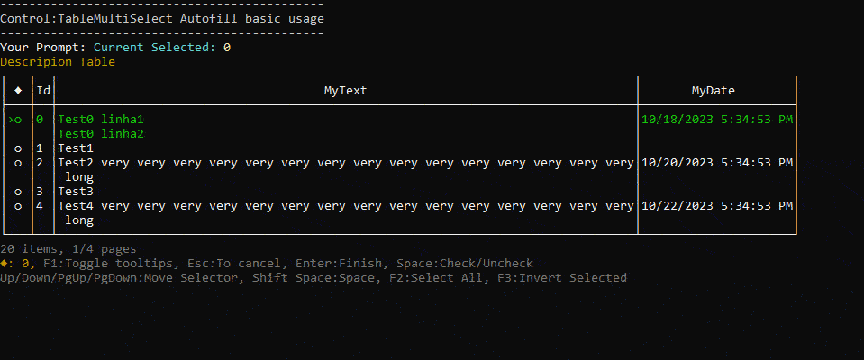

[**Top**](#table-of-contents)  | [Samples](https://github.com/FRACerqueira/PromptPlus/tree/main/Samples/TableSelectSamples)

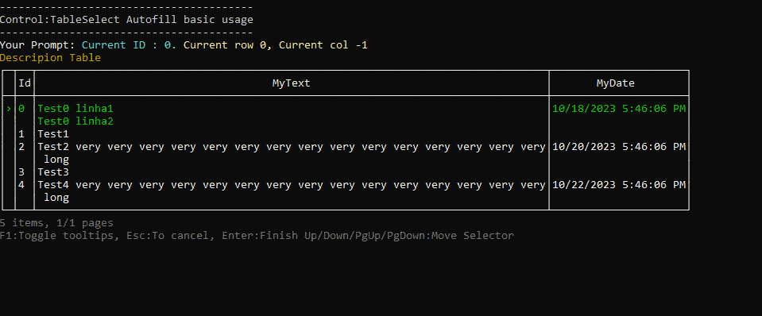

[**Top**](#table-of-contents)  | [Samples](https://github.com/FRACerqueira/PromptPlus/tree/main/Samples/TableBasicSamples)

### TreeView

[**Top**](#table-of-contents)  | [Samples](https://github.com/FRACerqueira/PromptPlus/tree/main/Samples/TreeViewMultiSelectSamples)

[**Top**](#table-of-contents)  | [Samples](https://github.com/FRACerqueira/PromptPlus/tree/main/Samples/TreeViewSamples)

### Wait Tasks

[**Top**](#table-of-contents)  | [Samples](https://github.com/FRACerqueira/PromptPlus/tree/main/Samples/WaitTasksSamples)

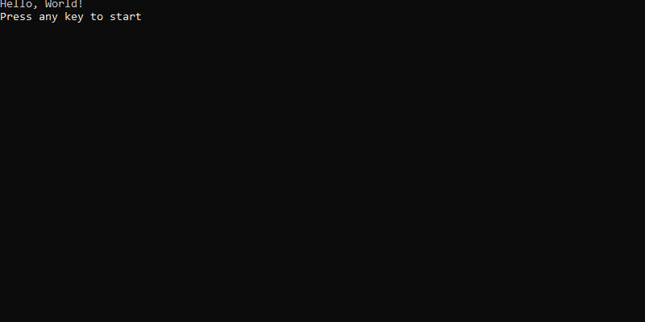

### Wait Timer

[**Top**](#table-of-contents)  | [Samples](https://github.com/FRACerqueira/PromptPlus/tree/main/Samples/WaitTimerSamples)

